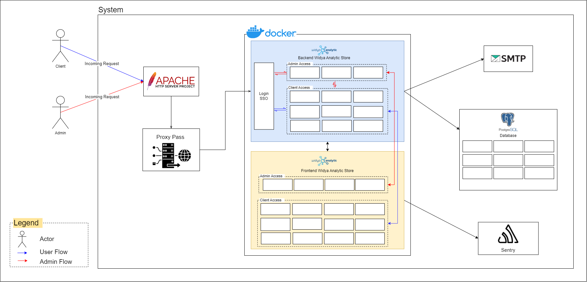

High Level Architecture
+++++++++++++++++++++++

High Level Architecture atau dapat disingkat sebagai HLA merupakan kerangka arsitektur secara umum yang eksis dalam sistem aplikasi atau *software* sehingga *developer* ataupun orang lain dapat memahami sistem yang sedang berjalan. Pada *software* Widay Analytics Store atau WAStore memiliki HLA sebagai berikut.

Pada gambar diatas merupakan representasi dari arsitektur yang ada pada aplikasi WAStore. Dapat dilihat bahwa dalam mengakases
WAStore terdapat dua *actor* yang dapat menggunakan WAStore, yakni Admin dan *user*. Adapun Penjelasan akses pada admin dan *user* sebagai berikut.

Admin
=====

Akses admin dilakukan untuk mengatur dan mengontrol sistem secara umum. Pada HLA diatas, tampak bahwa admin (yang ditunjukan pada *flow* berwarna merah). Adapun detail dari admin sebagai berikut.
1. Admin akan mengakses sitem melalui HTTP Apache server.
2. Kemudian, sebelum memasuki docker akan dilakukan *proxy pass*.
3. Lalu admin akan masuk ke docker untuk mengakses keseluruhan sistem.
4. Hal yang pertama dilakukan adalah Admin akan *login* SSO Widya Analytic. Aktivitas *login* ini dilakuakn dengan mengakses endpoint *Admin Access*
5. Dalam proses Login, admin juga akan mengakses *forntend* sebagai tampilan *login* yang dilakukan.
6. Setelah berhasil login, Admin dapat melakukan berbagai aktivitas dengan beberapa hal yang dibatasi untuk dilakukan admin saja.
7. Dalam sistem backend akan mengakses SMTP dan Database
8. Pada frontend akan mengakses Sentry

User
====

Akses USer dilakukan untuk mengatur dan mengontrol sistem secara umum. Pada HLA diatas, tampak bahwa admin (yang ditunjukan pada *flow* berwarna merah). Adapun detail dari admin sebagai berikut.
1. User akan mengakses sitem melalui HTTP Apache server.
2. Kemudian, sebelum memasuki docker akan dilakukan *proxy pass*.
3. Lalu admin akan masuk ke docker untuk mengakses keseluruhan sistem.
4. Hal yang pertama dilakukan adalah Admin akan *login* SSO Widya Analytic. Aktivitas *login* ini dilakuakn dengan mengakses endpoint *Admin Access*
5. Dalam proses Login, admin juga akan mengakses *forntend* sebagai tampilan *login* yang dilakukan.
6. Setelah berhasil login, Admin dapat melakukan berbagai aktivitas dengan beberapa hal yang dibatasi untuk dilakukan admin saja.
7. Dalam sistem backend akan mengakses SMTP dan Database
8. Pada frontend akan mengakses Sentry
