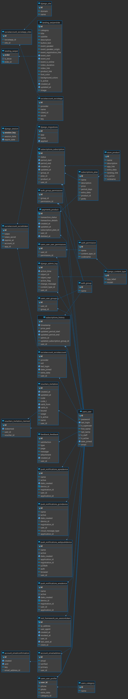

# Schema Toba Register

Merupakan Schema data yang menjadi main data dari Toba.ai Widay Analytic Store.

## **Akun**

Kelompok tabel yang mengatur data akun pengguna

### **AKUN ALAMAT EMAIL**

Berisi data akun berupa email dan user id pengguna. \
Nama Tabel : ``account_emailaddress``

| **Nama Kolom** | **Tipe**    | **Tipe Data** | **Isi**                                      | **Catatan** |
| -------------- | ----------- | ------------- | -------------------------------------------- | ----------- |
| **id**         | Primary Key | SERIAL        | Nomor ID                                     |             |
| **email**      | \-          | VARCHAR(254)  | Alamat email                                 | Unique Key  |
| **verified**   | \-          | BOOL          | Status terverifikasi                         |             |
| **primary**    | \-          | BOOL          | 111                                          |             |
| **user\_id**   | Foreign Key | INT           | Nomor ID yang merujuk pada table users\_user |             |

### **KONFIRMASI AKUN**

Berisi data akun yang harus dilakukan konfirmasi.\
Nama Tabel : ``account_emailconfirmation``

| **Nama Kolom**         | **Tipe**    | **Tipe Data** | **Isi**                                                      | **Catatan** |
| ---------------------- | ----------- | ------------- | ------------------------------------------------------------ | ----------- |
| **id**                 | PRIMARY KEY | SERIAL4       | Nomor ID                                                     |             |
| **created**            |             | TIMESTAMPTZ   | Timestamp kapan data dibuat                                  |             |
| **sent**               |             | TIMESTAMPTZ   | Timestamp kapan data dikirim                                 |             |
| **key**                |             | VARCHAR(64)   |                                                              |             |
| **email\_address\_id** | FOREIGN KEY | INT4          | Nomor ID email yang merujuk dari tabel account\_emailaddress |             |

## **Auth**

Kelompok tabel yang mengatur autentikasi pengguna

### **PENGELOMPOKAN AUTENTIKASI PENGGUNA**

Berisi field data untuk mendefinisikan user menjadi admin, trial, atau paid. \
Nama Tabel : ``auth_group``

| **Nama Kolom** | **Tipe**    | **Tipe Data** | **Isi**                                                                                | **Catatan** |
| -------------- | ----------- | ------------- | -------------------------------------------------------------------------------------- | ----------- |
| **id**         | Primary Key | SERIAL        | Nomor ID                                                                               |             |
| **name**       |             | VARCHAR(150)  | Nama yang memuat _role_ autentikasi, seperti admin, _trial_, dan _paid_. | UNIQUE KEY |

### **PENGELOMPOKAN AKSI AKSES TERHADAP PENGGUNA**

Berisi field data yang mengelompokkan kelompok user untuk dapat melakukan aksi tertentu berdasarkan permission_id dalam lingkup django dashboard (masih digunakan hanya oleh engineer).
Nama Tabel: ``auth_group_permissions``

| **Nama Kolom**     | **Tipe**    | **Tipe Data** | **Isi**                                           | **Catatan** |
| ------------------ | ----------- | ------------- | ------------------------------------------------- | ----------- |
| **id**             | PRIMARY KEY | SERIAL        | Nomor ID                                          |             |
| **group\_id**      | UNIQUE KEY  | INT           | Nomor ID yang merujuk pada tabel auth\_group.     |             |
| **permission\_id** | UNIQUE KEY  | INT           | Nomor ID yang merujuk pada tabel auth\_permission |             |

### **PENGELOMPOKAN AKSI AKSES PENGGUNA**

Berisi field data yang mengelompokkan aksi akses yang dapat dilakukan oleh pengguna. \
Nama Tabel: ``auth_permission``

| **Nama Kolom**        | **Tipe**    | **Tipe Data** | **Isi**                                                  | **Catatan** |
| --------------------- | ----------- | ------------- | -------------------------------------------------------- | ----------- |
| **id**                | Primary Key | SERIAL        | Nomor ID                                                 |             |
| **name**              |             | VARCHAR(255)  | Berisi aksi-aksi yang dapat dilakukan                    |             |
| **content\_type\_id** |             | INT           | Nomor ID yang merujuk pada tabel django\_content\_type   | Unique Key  |
| **codename**          |             | VARCHAR(100)  | Berisi aksi-aksi yang dapat dilakukan dalam bentuk kode. | Unique Key  |

## **Django**

Kelompok tabel yang menjadi bawaan dari _framework_ Django

### **DJANGO ADMIN LOG**

Berisi terkait aktivitas dashboard admin. \
Nama Tabel: ``django_admin_log``
| **Nama Kolom**        | **Tipe**    | **Tipe Data** | **Isi**                                                   | **Catatan** |
| --------------------- | ----------- | ------------- | --------------------------------------------------------- | ----------- |
| **id**                | Primary Key | SERIAL        | Nomor ID                                                  |             |
| **action\_time**      |             | TIMESTAMPTZ   | Timestamp untuk menyimpan riwayat waktu dilakukannya aksi |             |
| **object\_id**        |             | TEXT          | 111                                                       |             |
| **object\_repr**      |             | VARCHAR(200)  | 111                                                       |             |
| **action\_flag**      |             | INT           | 111                                                       | CHECK       |
| **change\_message**   |             | TEXT          | Pesan perubahan yang terjadi                              |             |
| **content\_type\_id** | Foreign Key | INT           | Nomor ID yang merujuk pada tabel django\_content\_type    |             |
| **user\_id**          | Foreign Key | INT           | Nomor ID yang merujuk pada tabel user\_users              |             |

### **DJANGO CONTENT TYPE**

Mendifiniskan permission melalui representasi model. \
Nama Tabel: ``django_content_type``

| **Nama Kolom** | **Tipe**    | **Tipe Data** | **Isi**                             | **Catatan** |
| -------------- | ----------- | ------------- | ----------------------------------- | ----------- |
| **id**         | Primary Key | SERIAL4       | Nomor ID                            |             |
| **app\_label** |             | VARCHAR(100)  | Memuat informasi/label _permission_ | Unique Key  |
| **model**      |             | VARCHAR(100)  | Mengkategorikan _permission_        | Unique Key  |

### **DJANGO MIGRATION**

Berisi riwayat perubahan data yang terjadi pada schema (_migrate_). \
Nama Tabel: ``django_migration``

| **Nama Kolom** | **Tipe**    | **Tipe Data** | **Isi**                             | **Catatan** |
| -------------- | ----------- | ------------- | ----------------------------------- | ----------- |
| **id**         | PRIMARY KEY | SERIAL        | Nomor ID                            |             |
| **app**        | \-          | VARCHAR(255)  | 1111Cari di Dokumentasi Token       |             |
| **name**       | \-          | VARCHAR(255)  | 1111Cari di Dokumentasi Token       |             |
| **applied**    | \-          | TIMESTAMTZ    | Timestamp kapan perubahan dilakukan |             |

### **DJANGO SESSION**

Tabel yang berfungsi untuk menyimpan aktivitas session user. \
Nama Tabel: ``django_session``

| **Nama Kolom**    | **Tipe**    | **Tipe Data** | **Isi**                            | **Catatan** |
| ----------------- | ----------- | ------------- | ---------------------------------- | ----------- |
| **session\_key**  | PRIMARY KEY | VARCHAR(40)   | Kunci _session_                    |             |
| **session\_data** | \-          | TEXT          | Data _session_                     |             |
| **expire\_date**  | \-          | TIMESTAMPTZ   | Timestamp kapan _session_ berakhir |             |

### **DJANGO SITE**

Menyimpan alamat aplikasi. \
Nama Tabel: ``django_site``

| **Nama Kolom** | **Tipe**    | **Tipe Data** | **Isi**         | **Catatan** |
| -------------- | ----------- | ------------- | --------------- | ----------- |
| **id**         | Primary Key | SERIAL        | Nomor ID        |             |
| **domain**     |             | VARCHAR(100)  | Domain aplikasi | Unique Key  |
| **name**       |             | VARCHAR(50)   | Nama domain     |             |

### **SSO SESSION TOKEN**

Berisi data untuk SSO Session Token dengan menggunakan Framework Django. \
Nama Tabel: ``rest_framework_sso_sessiontoken``
| **Nama Kolom**     | **Tipe**    | **Tipe Data** | **Isi**                                        | **Catatan** |
| ------------------ | ----------- | ------------- | ---------------------------------------------- | ----------- |
| **id**             | Primary Key | UUID          | Nomor ID                                       |             |
| **Ip\_address**    |             | INET          | Alamat IP                                      |             |
| **User\_agent**    |             | VARCHAR(1000) | Mengidentifikasi jenis browser                 |             |
| **Created\_at**    |             | TIMESTAMPTZ   | Timestamp kapan session dibuat                 |             |
| **Revoked\_at**    |             | TIMESTAMPTZ   | Timestamp kapan data ditarik kembali           |             |
| **user\_id**       | Foreign Key | INT4          | Nomor ID yang merujuk pada tabel user\_users   |             |
| **Last\_used\_at** |             | TIMESTAMPTZ   | Timestamp kapan terakhir kali session digunkan |             |
| **Client\_id**     |             | VARCHAR(1000) | Nomor ID klien yang terhubung ke layanan       |             |

## **Feedback**

Kelompok tabel dalam menyimpan data _feedback_ dari pengguna

### **FEEDBACK**

Berisi data feedback yang diberikan oleh pengguna. \
Nama Tabel: ``feedback_feedback``
| **Nama Kolom**   | **Tipe**    | **Tipe Data** | **Isi**                                                                   | **Catatan** |
| ---------------- | ----------- | ------------- | ------------------------------------------------------------------------- | ----------- |
| **id**           | Primary Key | SERIAL4       | Nomor ID                                                                  |             |
| **satisfaction** |             | VARCHAR(20)   | Berisi tingkat kepuasan dari pengguna                                     |             |
| **type**         |             | VARCHAR(20)   | Tipe atau jenis _feedback_ yang diberikan                                 |             |
| **page**         |             | VARCHAR(40)   | Letak halaman atau _page_ atau bagian _website_ yang diberikan _Feedback_ |             |
| **message**      |             | TEXT          | Pesan _feedback_ yang diberikan oleh pengguna                             |             |
| **attachment**   |             | VARCHAR(100)  | Lampiran _feedback_ dari pengguna                                         |             |
| **created\_at**  |             | TIMESTAMPTZ   | Timestamp kapan data dibuat                                               |             |
| **user\_id**     | Foreign Key | INT4          | Nomor ID yang merujuk pada tabel user\_users                              |             |

## **Landing Slide**

Kelompok tabel dalam mengatur _landing slide_ pada tampilan awal

### **LANDING SWIPER**

Berisi data landing page yang ditampilkan. \
Nama Tabel: ``landing_swiper``
| **Nama Kolom** | **Tipe**    | **Tipe Data** | **Isi**                                               | **Catatan** |
| -------------- | ----------- | ------------- | ----------------------------------------------------- | ----------- |
| **order**      | Primary Key | SERIAL4       | Urutan untuk ditampilkan pada _landing page_          |             |
| **is\_show**   |             | BOOL          | Ceklis dSata apakah akan ditampilkan atau tidak       |             |
| **Slide\_id**  | Foreign Key | UUID          | Nomor ID yang merujuk pada tabel landing\_swiperslide |             |

### **LANDING SWIPERSLIDE**

Berisi detail data dari swiper slide pada landing page. \
Nama Tabel: ``landing_swiperslide``
| **Nama Kolom**                | **Tipe**    | **Tipe Data** | **Isi**                                                  | **Catatan** |
| ----------------------------- | ----------- | ------------- | -------------------------------------------------------- | ----------- |
| **id**                        | Primary Key | SERIAL        | Nomor ID                                                 |             |
| **Category**                  |             | VARCHAR(20)   | Kategori slide                                           |             |
| **Title**                     |             | VARCHAR(225)  | Judul slide yang ditampilkan                             |             |
| **Subtitle**                  |             | VARCHAR(225)  | Deskripsi singkat terkait Judul                          |             |
| **Description**               |             | TEXT          | Deskripsi lengkap terkait swiper slide pada landing page |             |
| **Button\_text**              |             | VARCHAR(225)  | Teks yang akan muncul di button                          |             |
| **Event\_speaker**            | Foreign Key | VARCHAR(225)  | Nama pembicara                                           |             |
| **Event\_speaker\_origin**    |             | VARCHAR(225)  | Asal pembicara                                           |             |
| **Event\_registration\_link** |             | VARCHAR(225)  | Tautan registrasi                                        |             |
| **Event\_start**              |             | TIMESTAMPTZ   | Timestamp kapan event dimulai                            |             |
| **Event\_end**                |             | TIMESTAMPTZ   | Timestamp kapan event berakhir                           |             |
| **Event\_is\_online**         |             | BOOL          | Ceklis event apakah online atau tidak                    |             |
| **Video\_duration**           |             | INT4          | Durasi video                                             | CHECK       |
| **Video\_link**               |             | VARCHAR(225)  | Tautan video                                             |             |
| **Product\_link**             |             | VARCHAR(225)  | Tautan produk                                            |             |
| **Font\_color**               |             | VARCHAR(18)   | Kode warna _font_                                        |             |
| **Background\_colors**        |             | JSONB         | Kode warna _background_                                  |             |
| **Is\_active**                |             | BOOL          | Ceklis untuk menentukan apakah slide aktif atau tidak    |             |
| **Created\_at**               |             | TIMESTAMPTZ   | Timestamp kapan slide dibuat                             |             |
| **Updated\_at**               |             | TIMESTAMPTZ   | Timestamp kapan event diperbarui                         |             |
| **image**                     |             | VARCHAR(100)  | Gambar yang akan ditampilkan                             |             |

## **Payment and Store Product**

Kelompok tabel dalam menyimpan data transaksi dan data layanan yang tersedia

### **PAYMENTS PRODUCT**

Berisi data transaksi produk yang sudah dilakukan pengguna. \
Nama Tabel: ``payments_product``
| **Nama Kolom**             | **Tipe**    | **Tipe Data** | **Isi**                                              | **Catatan** |
| -------------------------- | ----------- | ------------- | ---------------------------------------------------- | ----------- |
| **id**                     | Primary Key | UUID          | Nomor ID                                             |             |
| **Transaction\_status**    |             | VARCHAR(20)   | Status transaksi                                     |             |
| **Transaction\_details**   |             | JSONB         | Detail transaksi berbentuk JSON                      |             |
| **Created\_at**            |             | TIMESTAMPTZ   | Timestamp kapan transaksi dibuat                     |             |
| **Updated\_at**            |             | TIMESTAMPTZ   | Timestamp kapan transaksi diperbarui                 |             |
| **Subscription\_plan\_id** | Foreign Key | INT4          | Nomor ID yang merujuk pada tabel subscriptions\_plan |             |
| **User\_id**               | Foreign Key | INT4          | Nomor ID yang merujuk pada tabel users\_user         |             |
| **Deleted\_at**            |             | TIMESTAMPTZ   | Timestamp kapan transaksi diperbarui                 |             |

### **STORE PRODUCT**

Berisi field data yang berisi produk yang tersedia. \
Nama Tabel: ``store_product``

| **Nama Kolom**    | **Tipe**    | **Tipe Data** | **Isi**                          | **Catatan** |
| ----------------- | ----------- | ------------- | -------------------------------- | ----------- |
| **Id**            | Primary Key | SERIAL        | Nomor ID                         |             |
| **Name**          |             | VARCHAR(40)   | Nama produk                      |             |
| **description**   |             | TEXT          | Deskripsi produk                 |             |
| **app\_link**     |             | VARCHAR(200)  | Tautan aplikasi produk           |             |
| **extra\_data**   |             | JSONB         | Informasi lainnya berbentuk json |             |
| **Landing\_link** |             | VARCHAR(200)  | Tautan utama aplikasi            |             |
| **Is\_active**    |             | BOOL          | Ceklis data yang akitf           |             |
| **nickname**      |             | VARCHAR(40)   | Singkatan produk                 |             |

## **Push Notification**

Kelompok tabel bawan yang mengatur _push notification_ pada aplikasi

### **PUSH NOTIFICATIONS APNS DEVICE**

Berisi notifiaksi data untuk perangkat APNs atau (Apple Push Notification service). \
Nama Tabel: ``push_notifications_apnsdevice``
| **Nama Kolom**       | **Tipe**    | **Tipe Data** | **Isi**                                      | **Catatan** |
| -------------------- | ----------- | ------------- | -------------------------------------------- | ----------- |
| **id**               | Primary Key | SERIAL4       | Nomor ID                                     |             |
| **name**             |             | VARCHAR(225)  | Nama                                         |             |
| **active**           |             | BOOL          | Ceklis status aktif                          |             |
| **date\_created**    |             | TIMESTAMPTZ   | Timestamp kapan data dibuat                  |             |
| **Device\_id**       |             | UUID          | ID perangkat                                 |             |
| **registration\_id** |             | VARCHAR(200)  | ID registrasi                                |             |
| **user\_id**         | Foreign Key | INT4          | Nomor ID yang merujuk pada tabel users\_user | Unique Key  |
| **application\_id**  |             | VARCHAR(64)   | ID aplikasi                                  |             |

### **PUSH NOTIFICATIONS GCM DEVICE**

Berisi notifiaksi data untuk perangkat GCM atau (Google Cloud Messaging). \
Nama Tabel: ``push_notifications_gcmdevice``

| **Nama Kolom**           | **Tipe**    | **Tipe Data** | **Isi**                                      | **Catatan** |
| ------------------------ | ----------- | ------------- | -------------------------------------------- | ----------- |
| **id**                   | Primary Key | SERIAL4       | Nomor ID                                     |             |
| **name**                 |             | VARCHAR(225)  | Nama                                         |             |
| **active**               |             | BOOL          | Ceklis status aktif                          |             |
| **date\_created**        |             | TIMESTAMPTZ   | Timestamp kapan data dibuat                  |             |
| **Device\_id**           |             | INT8          | ID perangkat                                 |             |
| **registration\_id**     |             | TEXT          | ID registrasi                                |             |
| **user\_id**             | Foreign Key | INT4          | Nomor ID yang merujuk pada tabel users\_user | Unique Key  |
| **Cloud\_message\_type** |             | VARCHAR(3)    | Tipe _Cloude Message_                        |             |
| **application\_id**      |             | VARCHAR(64)   | ID aplikasi                                  |             |

### **PUSH NOTIFICATIONS WEB PUSH DEVICE**

Berisi notifiaksi data pada Website. \
Nama Tabel: ``push_notifications_webpushdevice``
| **Nama Kolom**       | **Tipe**    | **Tipe Data** | **Isi**                                                                | **Catatan** |
| -------------------- | ----------- | ------------- | ---------------------------------------------------------------------- | ----------- |
| **id**               | Primary Key | SERIAL4       | Nomor ID                                                               |             |
| **name**             |             | VARCHAR(225)  | Nama                                                                   |             |
| **active**           |             | BOOL          | Ceklis status aktif                                                    |             |
| **date\_created**    |             | TIMESTAMPTZ   | Timestamp kapan data dibuat                                            |             |
| **application\_id**  |             | VARCHAR(64)   | ID aplikasi                                                            |             |
| **registration\_id** |             | TEXT          | ID registrasi                                                          | Unique Key  |
| **P256dh**           |             | VARCHAR(88)   | Public key yang digunakan untuk enkripsi pesan dalam push notification |             |
| **auth**             |             | VARCHAR(24)   | Autentikasi data                                                       |             |
| **browser**          |             | VARCHAR(10)   | Browser yang digunakan                                                 |             |
| **user\_id**         | Foreign Key | INT4          | Nomor ID yang merujuk pada tabel users\_user                           |             |

### **PUSH NOTIFICATIONS WNS DEVICE**

Berisi notifiaksi data untuk perangkat WNS atau Windows Notification Service. \
Nama Tabel: ``push_notifications_wnsdevice``
| **Nama Kolom**       | **Tipe**    | **Tipe Data** | **Isi**                                      | **Catatan** |
| -------------------- | ----------- | ------------- | -------------------------------------------- | ----------- |
| **id**               | Primary Key | SERIAL4       | Nomor ID                                     |             |
| **name**             |             | VARCHAR(225)  | Nama                                         |             |
| **active**           |             | BOOL          | Ceklis status aktif                          |             |
| **date\_created**    |             | TIMESTAMPTZ   | Timestamp kapan data dibuat                  |             |
| **Device\_id**       |             | UUID          | ID perangkat                                 |             |
| **registration\_id** |             | TEXT          | ID registrasi                                |             |
| **user\_id**         | Foreign Key | INT4          | Nomor ID yang merujuk pada tabel users\_user | Unique Key  |
| **application\_id**  |             | VARCHAR(64)   | ID aplikasi                                  |             |

## **Social Account**

Kelompok tabel yang mengatur pengaturan _Social Account_ yang dimiliki pengguna.

### **SOCIAL ACCOUNT**

Berisi data akun Widya Analytics Store dari pengguna. \
Nama Tabel: ``socialaccount_socialaccount``

| **Nama Kolom**   | **Tipe**    | **Tipe Data** | **Isi**                                      | **Catatan** |
| ---------------- | ----------- | ------------- | -------------------------------------------- | ----------- |
| **id**           | Primary Key | SERIAL        | Nomor ID                                     |             |
| **provider**     |             | VARCHAR(30)   | Nama _provider_ media sosial                 | Unique Key  |
| **uid**          |             | VARCHAR(191)  | Nilai numerik _identifier_                   | Unique Key  |
| **last\_login**  |             | TIMESTAMPTZ   | Timestamp kapan terakhir _login_             |             |
| **date\_joined** |             | TIMESTAMPTZ   | Timestamp kapan _user_ bergabung             |             |
| **extra\_data**  |             | TEXT          | Berisi keterangan data lain                  |             |
| **user\_id**     | Foreign Key | INT           | Nomor ID yang merujuk pada tabel user\_users |             |

### **APLIKASI AKUN SOSIAL**

Berisi data sosial media yang digunakan. \
Nama Tabel: ``socialaccount_socialapp``

| **Nama Kolom** | **Tipe**    | **Tipe Data** | **Isi**                      | **Catatan** |
| -------------- | ----------- | ------------- | ---------------------------- | ----------- |
| **id**         | Primary Key | SERIAL        | Nomor ID                     |             |
| **provider**   |             | VARCHAR(30)   | Nama _provider_ media sosial |             |
| **name**       |             | VARCHAR(40)   | Nama Social App              |             |
| **client\_id** |             | VARCHAR(191)  | Nomor ID dari _provider_     |             |
| **secret**     |             | VARCHAR(191)  | Token yang bersifat rahasia  |             |
| **key**        |             | VARCHAR(191)  | 111                          |             |

### **_SITES_ APLIKASI AKUN SOSIAL**

Merupakan tabel yang mengintegrasikan atau mengelompokkan aplikasi akun sosial dengan sites Toba.ai. \
Nama Tabel: ``socialaccount_socialapp_sites``

| **Nama Kolom**    | **Tipe**    | **Tipe Data** | **Isi**                                                   | **Catatan** |
| ----------------- | ----------- | ------------- | --------------------------------------------------------- | ----------- |
| **id**            | PRIMARY KEY | SERIAL        | Nomor ID                                                  |             |
| **socialapp\_id** |             | INT           | Nomor ID yang merujuk pada tabel socialaccount\_socialapp | UNIQUE KEY  |
| **site\_id**      |             | INT           | Nomor ID yang merujuk pada tabel django\_site             | UNIQUE KEY  |

### **TOKEN APLIKASI**

 Berisi field data yang memberikan Token pada setiap akun dan aplikasi. \
 Nama Tabel: ``socialaccount_socialtoken``

| **Nama Kolom**    | **Tipe**    | **Tipe Data** | **Isi**                                                       | **Catatan** |
| ----------------- | ----------- | ------------- | ------------------------------------------------------------- | ----------- |
| **id**            | PRIMARY KEY | SERIAL        | Nomor ID                                                      |             |
| **token**         |             | TEXT          | Token untuk autentikasi dengan provider Sosmed                |             |
| **token\_secret** |             | TEXT          | Secret Token                                                  |             |
| **expires\_at**   |             | TIMESTAMPTZ   | Timestamp kapan status _user_ berakhir                        |             |
| **account\_id**   | FOREIGN KEY | INT           | Nomor ID yang merujuk pada tabel socialaccount\_socialaccount |             |
| **app\_id**       | FOREIGN KEY | INT           | Nomor ID yang merujuk pada tabel socialaccount\_socialapp     |             |

## **Subscription**

Kelompok tabel yang menyimpan data pengguna untuk melakukan langganan

### **SUBSCRIPTION HISTORY**

Berisi field data yang memberikan informasi terkait batasan akun ig, kompetitor ig, dan social account. \
Nama Tabel: ``subscriptions_history``
| **Nama Kolom**                       | **Tipe**    | **Tipe Data** | **Isi**                                      | **Catatan** |
| ------------------------------------ | ----------- | ------------- | -------------------------------------------- | ----------- |
| **id**                               | Primary Key | SERIAL4       | Nomor ID yang merujuk pada tabel auth\_group |             |
| **timestamp**                        |             | TIMESTAMPTZ   | 111                                          |             |
| **Price\_paid**                      |             | INT4          | 111                                          |             |
| **Updated\_period\_start**           |             | TIMESTAMPTZ   | 111                                          |             |
| **Updated\_period\_end**             |             | TIMESTAMPTZ   |                                              |             |
| **Admin\_id**                        | Foreign Key | INT4          | Nomor ID Admin                               |             |
| **Updated\_subscription\_group\_id** | Foreign Key | INT4          | Nomor ID yang diperbarui dari tabel auth     |             |
| **User\_id**                         | Foreign Key | INT4          | Nomor ID yang merujuk pada tabel users\_user |             |

### **SUBSCRIPTION PLAN**

Berisi field data yang men-define plan atau paket langganan apa saja yang disediakan Toba.ai WA Store. \
Nama Tabel: ``subscriptions_plan``

| **Nama Kolom**   | **Tipe**    | **Tipe Data** | **Isi**                                         | **Catatan** |
| ---------------- | ----------- | ------------- | ----------------------------------------------- | ----------- |
| **id**           | Primary Key | SERIAL        | Nomor ID                                        |             |
| **name**         |             | VARCHAR(225)  | Nama paket langganan                            |             |
| **description**  |             | TEXT          | Deskripsi paket langganan                       |             |
| **price**        |             | INT           | Harga paket langganan                           |             |
| **period\_days** |             | INT           | Durasi paket langganan                          |             |
| **extra\_data**  |             | JSONB         | Informasi tambahan berbentuk jsonb              |             |
| **product\_id**  | Foreign Key | INT           | Nomor ID yang merujuk pada tabel store\_product |             |

### **AKUN PELANGGAN SUBSCRIPTION**

Berisi field data yang berisi user yang telah melakukan langganan. \
Nama Tabel: ``subscriptions_subscription``

| **Nama Kolom**    | **Tipe**    | **Tipe Data** | **Isi**                                                   | **Catatan** |
| ----------------- | ----------- | ------------- | --------------------------------------------------------- | ----------- |
| **user\_id**      | Foreign Key | INT           | Nomor ID yang merujuk pada tabel users\_user              | Unique Key  |
| **product \_id**  | Foreign Key | INT           | Nomor ID yang merujuk pada tabel store\_product           | Unique Key  |
| **period\_end**   |             | TIMESTAMPTZ   | Timestamp kapan status langganan berakhir                 |             |
| **group\_id**     | Foreign Key | INT           | Nomor ID yang merujuk pada tabel subscriptions\_group     |             |
| **period\_start** |             | TIMESTAMPTZ   | Timestamp kapan status langganan berakhir                 |             |
| **created\_at**   |             | TIMESTAMPTZ   | Timestamp kapan status langganan dimulai                  |             |
| **id**            |             | UUID          | Nomor ID                                                  | Unique Key  |
| **status**        |             | VARCHAR(10)   | Status langganan                                          |             |
| **updated\_at**   |             | TIMESTAMPTZ   | Timestamp kapan terakhir kali status langganan diperbarui |             |
| **plan\_id**      | Foreign Key | INT           | Nomor ID yang merujuk pada tabel subscriptions\_plan      |             |

## **User**

Kelompok tabel yang mengatur akun _user_ WAStore

### **KATEGORI AKUN PENGGUNA**

Berisi field kategori data pengguna. \
Nama Tabel: ``users_category``
| **Nama Kolom** | **Tipe**    | **Tipe Data** | **Isi**                                                                 | **Catatan** |
| -------------- | ----------- | ------------- | ----------------------------------------------------------------------- | ----------- |
| **Id**         | PRIMARY KEY | SERIAL        | Nomor ID                                                                |             |
| **nama**       |             | VARCHAR(225)  | Nama Kategori Pengguna, seperi UMKM, Digital Agency, Umum, atau Pelajar |             |

### **AKUN PENGGUNA**

Berisi field data pengguna. \
Nama Tabel: ``users_user``

| **Nama Kolom**    | **Tipe**    | **Tipe Data** | **Isi**                                              | **Catatan** |
| ----------------- | ----------- | ------------- | ---------------------------------------------------- | ----------- |
| **id**            | PRIMARY KEY | SERIAL        | Nomor ID                                             |             |
| **password**      |             | VARCHAR(128)  | Token yang berisi password akun dari _user_          |             |
| **last\_login**   |             | TIMESTAMPTZ   | Timestamp kapan terakhir kali _user_ melakukan login |             |
| **is\_superuser** |             | BOOL          | Status Super _User_                                  |             |
| **first\_name**   |             | VARCHAR(150)  | Nama awal _user_                                     |             |
| **last\_name**    |             | VARCHAR(150)  | Nama akhir _user_                                    |             |
| **is\_staff**     |             | BOOL          | Status apakah _staff_ atau bukan                     |             |
| **is\_active**    |             | BOOL          | Status apakah aktif atau bukan                       |             |
| **date\_joined**  |             | TIMESTAMPTZ   | Timestamp kapan _user_ bergabung                     |             |
| **email**         | UNIQUE KEY  | VARCHAR(254)  | Email _user_ yang didaftarkan                        |             |

### **USER GROUP**

Berisi field data terkait data pengguna dan pelanggan. \
Nama Tabel: ``users_user_groups``

| **Nama Kolom** | **Tipe**    | **Tipe Data** | **Isi**                                               | **Catatan** |
| -------------- | ----------- | ------------- | ----------------------------------------------------- | ----------- |
| **id**         | Primary Key | SERIAL4       | Nomor ID                                              |             |
| **user\_id**   | Foreign Key | INT           | Nomor ID yang merujuk pada tabel users\_user          | Unique Key  |
| **group\_id**  | Foreign Key | INT           | Nomor ID yang merujuk pada tabel subscriptions\_group | Unique Key  |

### **PROFIL PENGGUNA**

Berisi field data terkait profil data pengguna. \
Nama Tabel: ``users_user_profile``
| **Nama Kolom**   | **Tipe**    | **Tipe Data** | **Isi**                                          | **Catatan** |
| ---------------- | ----------- | ------------- | ------------------------------------------------ | ----------- |
| **user\_id**     | PRIMARY KEY | INT           | Nomor ID yang merujuk pada tabel users\_user     | Unique Key  |
| **phone**        |             | VARCHAR(17)   |                                                  |             |
| **photo**        |             | VARCHAR(100)  |                                                  |             |
| **extra\_data**  |             | JSONB         |                                                  |             |
| **category\_id** | FOREIGN KEY | INT4          | Nomor ID yang merujuk pada tabel users\_category |             |

### **_Permissions_ _User_**

Berisi field data yang mengelompokkan pengguna degan permission yang dapat dilakukan. \
Nama Tabel: ``users_user_user_permissions``

| **Nama Kolom**     | **Tipe**    | **Tipe Data** | **Isi**                                           | **Catatan** |
| ------------------ | ----------- | ------------- | ------------------------------------------------- | ----------- |
| **id**             | PRIMARY KEY | SERIAL        | Nomor ID                                          |             |
| **user\_id**       | FOREIGN KEY | INT           | Nomor ID yang merujuk pada tabel users\_user      |             |
| **permission\_id** | FOREIGN KEY | INT           | Nomor ID yang merujuk pada tabel auth\_permission |             |

## **Vouchers**

Kelompok tabel yang menyimpan dan mengatur data _vouchers_ pada layanan WA Store.

### **VOUCHERS INVITATION**

Berisi field data terkait data undangan voucher. \
Nama Tabel: ``vouchers_invitation``
| **Nama Kolom**  | **Tipe**    | **Tipe Data** | **Isi**                                      | **Catatan** |
| --------------- | ----------- | ------------- | -------------------------------------------- | ----------- |
| **Id**          | Primary Key | SERIAL4       | Nomor ID                                     |             |
| **Created\_at** |             | TIMESTAMPTZ   | Timestamp kapan data dibuat                  |             |
| **updated\_at** |             | TIMESTAMPTZ   | Timestamp kapan data diperbarui              |             |
| **Code**        |             | VARCHAR(64)   | Kode Voucher _uppercase_                     |             |
| **Code\_l**     |             | VARCHAR(64)   | Kode Voucher _lowercasae_                    | Unique Key  |
| **Valid\_from** |             | TIMESTAMPTZ   | Timestamp kapan data voucher mulai valid     |             |
| **Valid\_to**   |             | TIMESTAMPTZ   | Timestamp kapan data voucher valid berakhir  |             |
| **bound**       |             | BOOL          |                                              |             |
| **usage**       |             | INT4          |                                              | CHECK       |
| **Is\_actvie**  |             | BOOL          | Keterangan status aktif voucher              |             |
| **name**        |             | VARCHAR(225)  | Nama Pembuat Voucher                         | Unique Key  |
| **User\_id**    | Foreign Key | INT4          | Nomor ID yang merujuk pada tabel users\_user |             |

### **KLAIM UNDANGAN VOUCHER**

Berisi field data yang berisi data pengguna yang melakukan klaim voucher. \
Nama Tabel: ``vouchers_invitation_claimed``
| **Nama Kolom**  | **Tipe**    | **Tipe Data** | **Isi**                                               | **Catatan** |
| --------------- | ----------- | ------------- | ----------------------------------------------------- | ----------- |
| **id**          | PRIMARY KEY | SERIAL4       | Nomor ID                                              |             |
| **redeemed**    |             | TIMESTAMPTZ   | Timestamp kapan voucher diklaim                       |             |
| **user\_id**    | FOREIGN KEY | INT           | Nomor ID yang merujuk pada tabel users\_user          |             |
| **voucher\_id** | FOREIGN KEY | INT           | Nomor ID yang merujuk pada tabel vouchers\_invitation |             |
