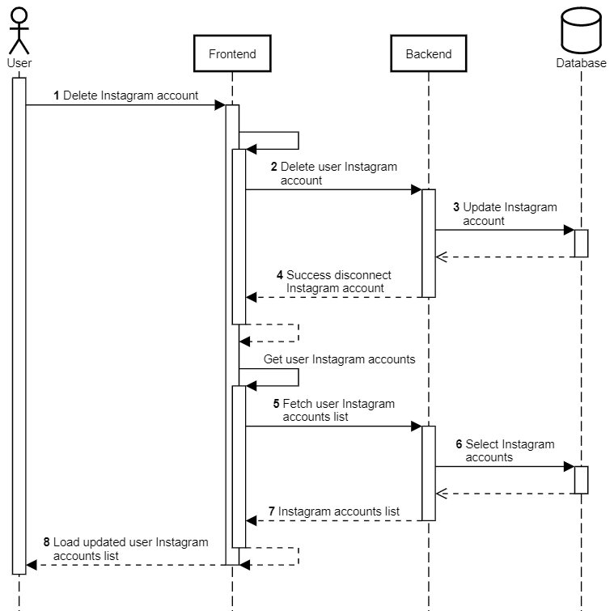
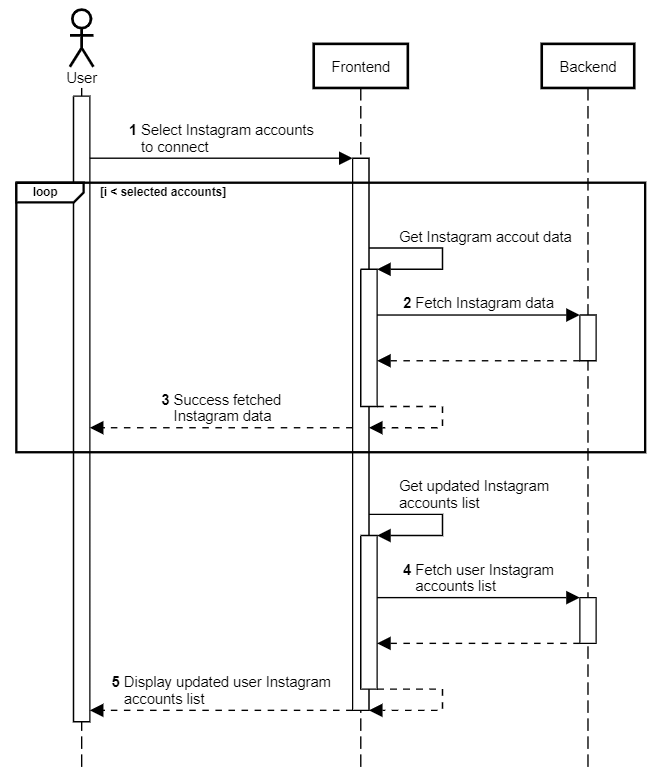

Kelola akun Instagram-Facebook
++++++++++++++++++++++++++++++

Fitur yang berperan sebagai pengelola akun Instagram-Facebook yang memungkinkan pengguna mengubah akun mana saja yang dapat diakses oleh aplikasi Toba.ai untuk ditampilkan analisis datanya.
Fitur-fitur yang menyertai halaman ini antara lain :ref:`account-delete-fb`, :ref:`account-delete-ig` dan :ref:`account-add-ig`.

Di bawah ini adalah diagram alur yang mewakili proses yang terjadi pada halaman ini disertai dengan penjelasannya.

.. figure:: ./account-manage-sequence.png
    :scale: 80
    :align: center

1. Pengguna membuka halaman **Kelola Akun**.
2. Frontend melakukan request ke endpoint :ref:`social-account-list`.
3. Backend mengambil daftar akun Facebook pengguna dari tabel ``public.socialaccount_socialaccount`` dan ``public.socialaccount_socialtoken``.
4. Backend mengembalikan daftar akun Facebook pengguna ke Frontend.
5. Jika pengguna dalam alur fitur re-otorisasi akun Facebook maka Frontend akan melakukan request ke endpoint :ref:`re-authorization`.
6. Backend akan menyimpan data token (terbaru) Facebook dari tabel ``public.socialaccount_socialtoken`` ke ``instagram.instagram_tokens``.
7. Backend menginfokan bahwa proses re-otorisasi akun Facebook berhasil.
8. Frontend akan mengalihkan pengguna ke halaman **Pilih Akun**.
9. Frontend memuat dan menampilkan kolom daftar akun Facebook and Instagram pengguna.
10. Frontend melakukan request ke endpoint :ref:`account-list`.
11. Backend mengambil daftar akun Instagram pengguna dari tabel ``instagram.user``, ``instagram.user_data`` dan ``public.socialaccount_socialaccount``.
12. Backend mengembalikan daftar akun Instagram pengguna ke Frontend.
13. Frontend melakukan request ke endpoint :ref:`subs-groups-list`.
14. Backend mengambil daftar group langganan dari tabel ``public.subscriptions_group``.
15. Backend mengembalikan daftar group langganan ke Frontend.
16. Frontend memuat dan menampilkan keterangan jumlah akun Instagram yang telah terkoneksi dengan CekBrand.

.. _account-delete-fb:

Hapus akun Facebook
-------------------

1. Pengguna menekan tombol *Lepas Tautan Facebook*.
2. Frontend melakukan request ke endpoint :ref:`social-account-delete`.
3. Backend menghapus data akun Facebook pengguna dari tabel ``public.socialaccount_socialaccount`` dan ``public.socialaccount_socialtoken``.
4. Backend menginfokan ke Frontend bahwa hapus akun Facebook berhasil.
5. Frontend melakukan request ke endpoint :ref:`social-account-list`.
6. Backend mengambil daftar akun pengguna dari tabel ``public.socialaccount_socialaccount`` dan ``public.socialaccount_socialtoken``.
7. Backend mengembalikan daftar akun pengguna.
8. Frontend memuat dan menampilkan daftar terbaru akun Facebook pengguna.

.. _account-delete-ig:

Hapus akun Instagram
====================

1. Pengguna menekan tombol *Lepas Koneksi* pada kolom akun Instagram.
2. Frontend melakukan request ke endpoint :ref:`account-delete`.
3. Backend mengubah data akun Instagram pengguna menjadi tidak terhubung pada tabel ``instagram.user``.
4. Backend menginfokan ke Frontend bahwa pemutusan akun Instagram berhasil.
5. Frontend melakukan request ke endpoint :ref:`account-list`.
6. Backend mengambil daftar akun pengguna dari tabel ``instagram.user``, ``instagram.user_data`` dan ``public.socialaccount_socialaccount``.
7. Backend mengembalikan daftar akun pengguna.
8. Frontend memuat dan menampilkan daftar terbaru akun Instagram pengguna.

.. _account-add-ig:

Menghubungkan akun Instagram
============================

1. Pengguna memilih akun-akun Instagram yang akan dihubungkan kemudian menekan tombol *Hubungkan*.
2. Frontend melakukan request ke endpoint :ref:`fetch-ig-data`.
3. Frontend menginfokan proses akuisisi data akun Instagram berhasil.
4. Frontend melakukan request ke endpoint :ref:`account-list`.
5. Frontend memuat dan menampilkan daftar terbaru akun Instagram pengguna.

