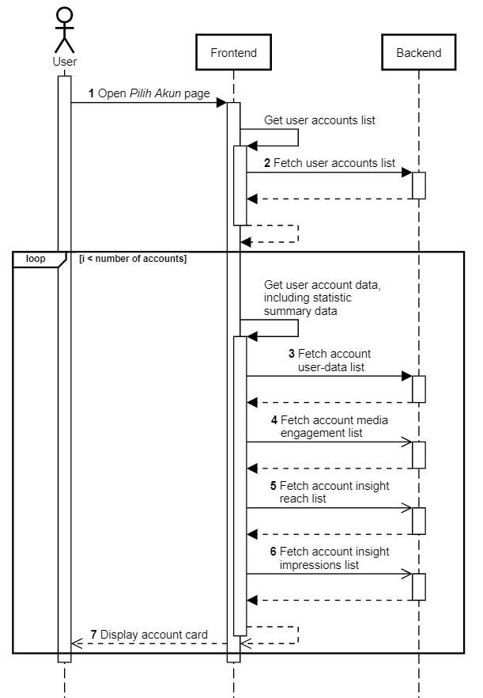

Pilih Akun Instagram
++++++++++++++++++++

Halaman utama dari Toba.ai Cekbrand yang menampilkan akun-akun Instagram yang telah terhubung ke dalam aplikasi Toba.ai.
Pada setiap kartu akun Instagram yang terhubung, ditampilkan rangkuman data statistik masin-masing akun Instagram.

1. Pengguna membuka halaman **Pilih Akun**.
2. Frontend melakukan request ke endpoint :ref:`account-list` untuk mendapatkan daftar akun pengguna.
3. Backend mengambil daftar akun pengguna dari tabel ``instagram.user``, ``instagram.user_data`` dan ``public.socialaccount_socialaccount``.
4. Backend mengembalikan daftar akun pengguna.
5. Frontend melakukan request ke endpoint :ref:`fetch-user-data` untuk mendapatkan data akun pengguna.
6. Backend mengambil data akun pengguna dari tabel ``instagram.user_data``.
7. Backend mengembalikan data akun pengguna.
8. Frontend melakukan request ke endpoint :ref:`engagement-list` untuk mendapatkan data engagement media akun pengguna.
9. Backend mengambil data engagement media akun pengguna dari tabel ``instagram.media_like_comment``.
10. Backend mengembalikan data engagement media akun pengguna.
11. Frontend melakukan request ke endpoint :ref:`reach-list` untuk mendapatkan data reach akun pengguna.
12. Backend mengambil data reach akun pengguna dari tabel ``instagram.user_insight_reach``.
13. Backend mengembalikan data reach akun pengguna.
14. Frontend melakukan request ke endpoint :ref:`impressions-list` untuk mendapatkan data impressions akun pengguna.
15. Backend mengambil data impressions akun pengguna dari tabel ``instagram.user_insight_impressions``.
16. Backend mengembalikan data impressions akun pengguna.
17. Frontend memuat dan menampilkan kolom (*card*) akun dengan rangkuman data statistik.
18. Pengguna memilih salah satu akun untuk lanjut ke halaman **Dashboard**.