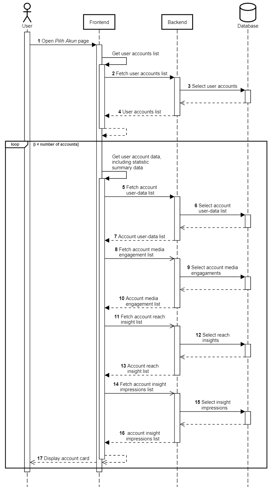

Pilih Akun Instagram
++++++++++++++++++++

Halaman utama dari Toba.ai Cekbrand yang menampilkan akun-akun Instagram yang telah terhubung ke dalam aplikasi Toba.ai.
Pada setiap kartu akun Instagram yang terhubung, ditampilkan rangkuman data statistik masin-masing akun Instagram.

1. Pengguna membuka halaman **Pilih Akun**.
2. Frontend melakukan request ke endpoint :ref:`account-list` untuk mendapatkan daftar akun pengguna.
3. Frontend melakukan request ke endpoint :ref:`fetch-user-data` untuk mendapatkan data akun pengguna.
4. Frontend melakukan request ke endpoint :ref:`engagement-list` untuk mendapatkan data engagement media akun pengguna.
5. Frontend melakukan request ke endpoint :ref:`reach-list` untuk mendapatkan data reach akun pengguna.
6. Frontend melakukan request ke endpoint :ref:`impressions-list` untuk mendapatkan data impressions akun pengguna.
7. Frontend memuat dan menampilkan kolom (*card*) akun dengan rangkuman data statistik.
8. Pengguna memilih salah satu akun untuk lanjut ke halaman **Dashboard**.