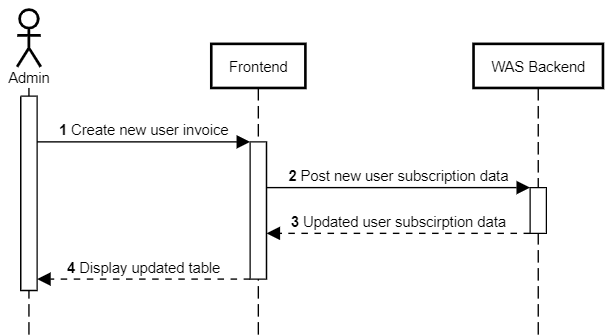

Buat Invoice Baru
+++++++++++++++++

*deskripsi*

1. Admin membuat invoice baru untuk pengguna.
2. Frontend melakukan request untuk mengubah data subscription pengguna.
3. Backend mengembalikan data pengguna dengan data subscription yang sudah diperbaharui.
4. Frontend memuat kembali tabel daftar pengguna.