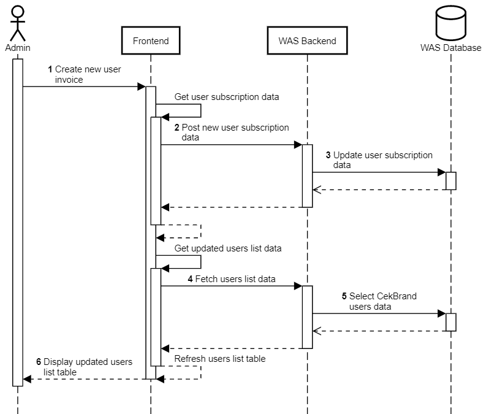

Buat Invoice Baru
+++++++++++++++++

1. Admin membuat invoice baru untuk pengguna.
2. Frontend melakukan request untuk mengubah data subscription pengguna.
3. Backend Widya Analytic Store (WAS) melakukan perubahan data subscription pengguna pada tabel ``public.subscriptions_subscription``.
4. Frontend melakukan request ke :ref:`account-user`.
5. Backend WAS mengambil daftar data pengguna CekBrand.
6. Frontend memuat kembali tabel daftar pengguna.