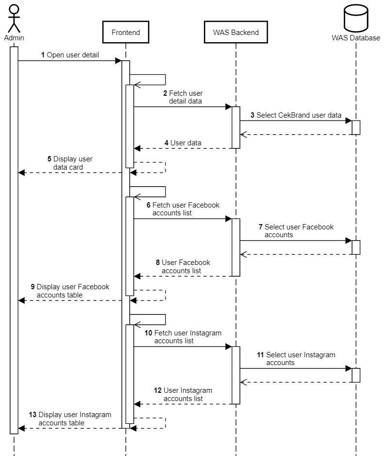

Detail Pengguna
+++++++++++++++

1. Admin membuka halaman detail pengguna.
2. Frontend melakukan request ke :ref:`account-user`.
3. Backend mengambil data user dari tabel ``public.users_user``, ``public.users_profile``, ``public.users_category``, dan ``public.subscriptions_subscription``.
4. Backend mengembalikan detail data pengguna.
5. Frontend memuat dan menampilkan kolom detail data pengguna.
6. Frontend melakukan request ke :ref:`facebook-list`.
7. Backend mengambil daftar akun Facebook pengguna dari tabel ``public.socialaccount_socialaccount``.
8. Backend mengembalikan daftar akun Facebook pengguna.
9. Frontend memuat dan menampilkan tabel akun Facebook pengguna.
10. Frontend melakukan request ke :ref:`instagram-list`.
11. Backend mengambil daftar akun Instagram pengguna dari tabel ``instagram.user``.
12. Backend mengembalikan daftar akun Instagram pengguna.
13. Frontend memuat dan menampilkan tabel akun Instagram pengguna.