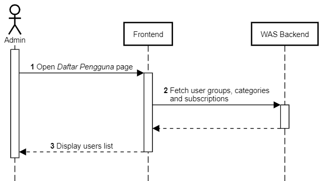

Daftar Pengguna
+++++++++++++++

1. Admin membuka halaman **Daftar Pengguna**.
2. Frontend melakukan request ke :ref:`subs-groups-list`.
3. Backend mengambil data grup dari tabel ``public.subscriptions_group``.
4. Backend mengembalikan daftar grup subscription.
5. Frontend melakukan request ke Backend Widya Analytic Store (WAS) untuk mendapatkan daftar subscription plans.
6. Backend mengambil data subscription plans dari tabel ``public.subscriptions_plan``.
7. Backend mengembalikan daftar subscription plans.
8. Frontend melakukan request Backend WAS untuk mendapatkan daftar kategori pengguna.
9. Backend mengambil daftar kategori pengguna dari tabel ``public.users_category``.
10. Backend mengembalikan daftar kategori pengguna.
11. Frontend memuat dan menampilkan daftar pengguna dalam bentuk tabel.
12. Frontend melakukan request ke :ref:`account-user`.
13. Backend mengambil daftar data pengguna CekBrand dari tabel ``public.users_user``, ``public.users_profile``, ``public.users_category``, dan ``public.subscriptions_subscription``.
14. Backend mengembalikan daftar data pengguna.
15. Frontend memuat dan menampilkan daftar pengguna dalam bentuk tabel.

