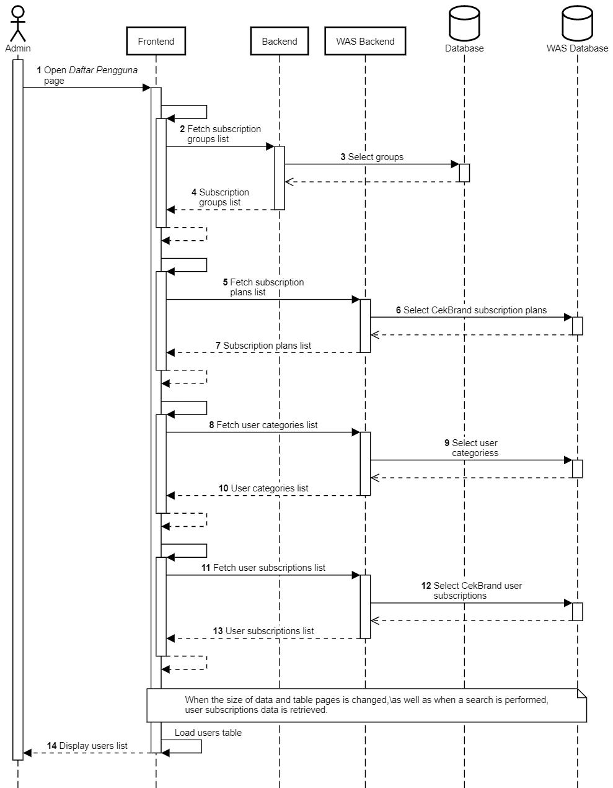

Daftar Pengguna
+++++++++++++++

1. Admin membuka halaman **Daftar Pengguna**.
2. Frontend melakukan request ke Backend Widya Analytic Store (WAS) untuk daftar *group*, *category* dan *subscription* pengguna.
3. Frontend memuat dan menampilakn daftar pengguna dalam bentuk tabel.

