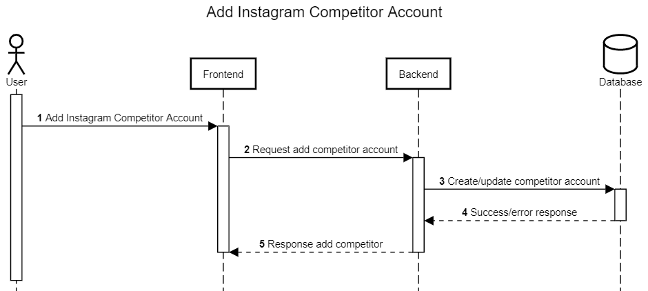

Add Competitor
++++++++++++++

Add competitor merupakan feature pertama saat halaman dashboard aplikasi Toba.ai Cekbrand terbuka 
dan memiliki fungsi untuk menambahkan account competitor yang dapat dibandingkan dengan account user.

1. Pengguna menekan tombol add instagram account competitor
2. Dari aksi pengguna tersebut, maka frontend akan melakukan request :ref:`add-competitor-accounts`.
3. Backend akan menyimpan atau mengupdate competitor kedalam database.
4. Backend akan mendapatkan response berupa data yang direquest pada tahap ke-3.
5. Backend akan mengembalikan response add competitor account toba.ai tahap ke-4 ke frontend.