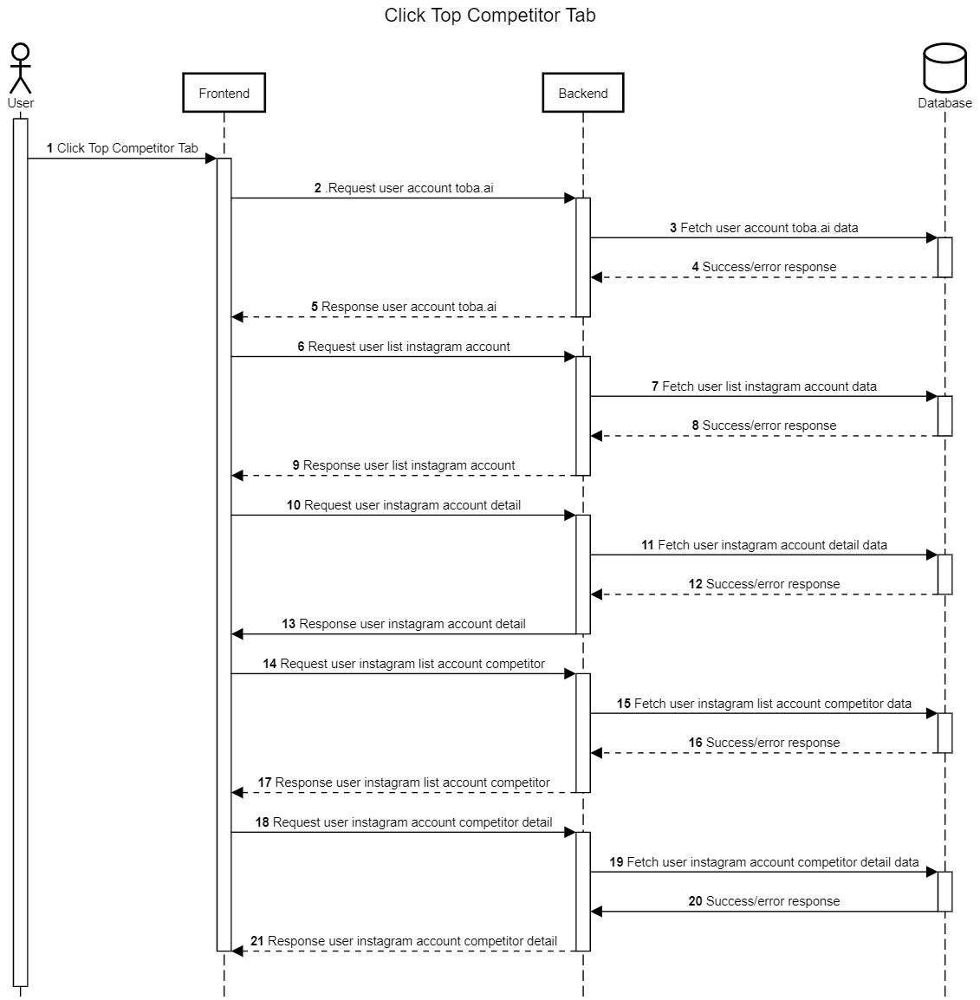

Click Top Competitor Tab
++++++++++++++++++++++++

Top competitor merupakan feature pertama saat halaman dashboard aplikasi Toba.ai Cekbrand terbuka dan memiliki fungsi unik 
untuk membandingkan performa statistik akun Instagram pengguna dengan akun Instagram lain. 
Halaman ini menampilkan resume singkat mengenai performa tiap akun, konten pos terbaik, serta variasi tagar yang sering digunakan oleh akun tersebu.

1. Pengguna membuka atau menekan tab kompetitor pada dashboard aplikasi Toba.ai CekBrand
2. Dari aksi pengguna tersebut, maka frontend akan melakukan request :ref:`account-user`.
3. Backend akan mencari data pengguna berdasarkan token data user active current login.
4. Backend akan mendapatkan response berupa data yang direquest pada tahap ke-3.
5. Backend akan mengembalikan response user account toba.ai tahap ke-4 ke frontend.
6. Frontend akan melakukan request user list instagram account dengan endpoint :ref:`fetch-list-ig-data`.
7. Backend akan mencari user list instagram account data di database.
8. Backend akan mendapatkan response berupa data yang direquest pada tahap ke-7.
9. Backend mengembalikan response user list instagram account ke frontend.
10. Frontend melakukan request ke backend dengan endpoint :ref:`fetch-ig-detail-data`, :ref:`fetch-user-summary-data`, :ref:`fetch-user-data`, :ref:`fetch-user-summary-data`, :ref:`fetch-hashtag-ig-user-data`.
11. Backend akan mencari user instagram account detail di database.
12. Backend akan mendapatkan response berupa data yang direquest pada tahap ke-11.
13. Backend mengembalikan response user instagram account detail.
14. Frontend melakukan request pada backend dengan endpoint :ref:`fetch-list-ig-competitor-data`.
15. Backend akan mencari user instagram list account competitor data.
16. Backend akan mendapatkan response berupa data yang direquest pada tahap ke-15.
17. Backend akan mengembalikan response user instagram list account competitor pada frontend.
18. Frontend akan melakukan request pada backend dengan endpoint :ref:`fetch-user-ig-competitor-data`, :ref:`fetch-media-average-ig-competitor-data`, :ref:`fetch-media-summary-ig-competitor-data`, :ref:`fetch-hashtag-ig-competitor-data` .
19. Backend akan mencari data sesuai request dari frontend.
20. Backend akan mendapatkan response berupa data yang direquest pada tahap ke-20.
21. Backend memberikan Backend akan mengembalikan response user instagram list account competitor detail pada frontend.