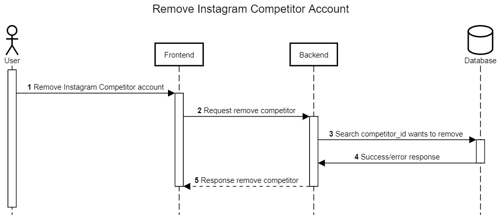

Remove Competitor
+++++++++++++++++

Remove competitor merupakan feature saat halaman dashboard aplikasi Toba.ai Cekbrand terbuka 
dan memiliki fungsi untuk menghapus account competitor yang dari dashboard aplikasi Toba.ai.

1. Pengguna menekan tombol remove instagram competitor account
2. Dari aksi pengguna tersebut, maka frontend akan melakukan request :ref:`remove-competitor-account`.
3. Backend akan mencari berdasarkan id instagram competitor yang ingin dihapus.
4. Backend akan mendapatkan response berupa data yang direquest pada tahap ke-3.
5. Backend akan mengembalikan response remove competitor account toba.ai tahap ke-4 ke frontend.