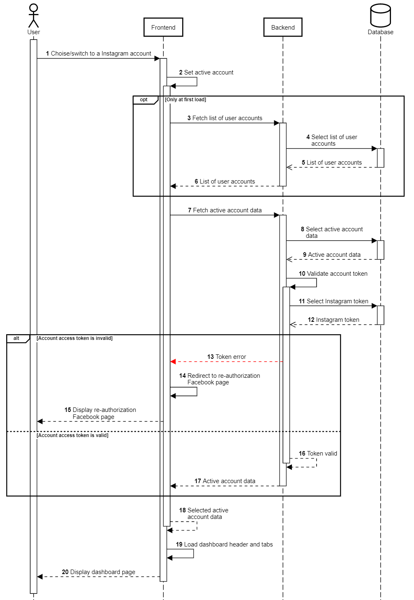

Dashboard
+++++++++

Halaman dashboard terdiri dari Kompetitor, Statistik dan Top Post.
Selain itu fitur yang melengkapi setiap halaman dashboard antara lain pindah akun, filter tanggal dan export/download data. 
Berikut adalah diagram alur yang mewakili halaman ini disertai penjelasannya.

1. Pengguna memilih akun Instagram pada halaman **Pilih Akun** atau mengganti akun pada menu di dashboard.
2. Frontend menetapkan akun yang dipilih menjadi *active account* pada dashboard.
3. Untuk kasus pertama kali mengunjungi halaman dashboard, Frontend terlebih dahulu melakukan request endpoint :ref:`account-list`.
4. Backend mengambil data daftar akun Instagram dari database ``instagram.user``, ``instagram.user_data`` dan ``public.socialaccount_socialaccount``.
5. Database mengembalikan data daftar akun Instagram yang dibutuhkan.
6. Backend mengembalikan daftar akun Instagram ke Frontend
7. Frontend melakukan request ke endpoint :ref:`account-detail`.
8. Backend mengambil data detail akun Instagram dari database ``instagram.user``, ``instagram.user_data`` dan ``public.socialaccount_socialaccount``.
9. Database mengembalukan data detail akun Instagram yang dibutuhkan.
10. Backend melakukan validasi *access token* akun Instagram terkait.
11. Jika token tidak valid Backend akan mengembalikan error.
12. Frontend akan mengalihkan tampilan ke halaman **Re-Authotization Facebook**.
13. Frontend menampilkan halaman tersebut pada Pengguna.
14. Jika token valid,
15. Backend mengembalikan data detail akun.
16. Frontend berhasil menetapkan *active account* pada dashboard.
17. Frontend memuat header dan tab-tab dashboard yang terdiri dari Kompetitor, Statistik dan Top Post.
18. Frontend menampilkan halaman dashboard pada Pengguna.