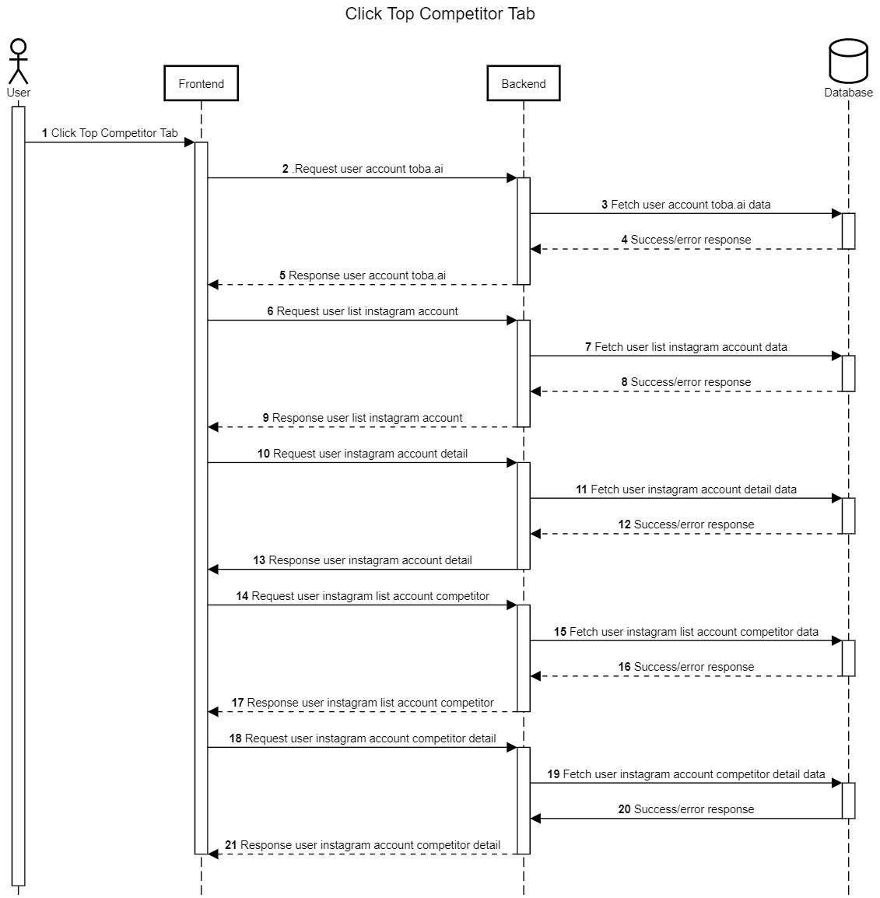

Halaman Top Competitor
++++++++++++++++++++++

Top competitor merupakan fitur pertama saat halaman dashboard aplikasi Toba.ai Cekbrand terbuka dan memiliki fungsi unik 
untuk membandingkan performa statistik akun Instagram pengguna dengan akun Instagram lain. 
Halaman ini menampilkan resume singkat mengenai performa tiap akun, konten pos terbaik, serta variasi tagar yang sering digunakan oleh akun tersebu.

1. Pengguna membuka atau menekan tab kompetitor pada dashboard aplikasi Toba.ai CekBrand
2. Dari aksi pengguna tersebut, maka frontend akan melakukan request :ref:`account-user`.
3. Backend akan mencari data pengguna berdasarkan token data user active current login.
4. Backend akan mendapatkan response berupa data yang direquest pada tahap ke-3.
5. Backend akan mengembalikan response user account toba.ai tahap ke-4 ke frontend.
6. Frontend akan melakukan request user list instagram account dengan endpoint :ref:`account-list`.
7. Backend akan mencari user list instagram account data di database.
8. Backend akan mendapatkan response berupa data yang direquest pada tahap ke-7.
9. Backend mengembalikan response user list instagram account ke frontend.
10. Frontend melakukan request ke backend dengan endpoint :ref:`account-detail`, :ref:`user-data-summary`, :ref:`fetch-user-data`, :ref:`fetch-hashtag-ig-user-data`.
11. Backend akan mencari user instagram account detail di database.
12. Backend akan mendapatkan response berupa data yang direquest pada tahap ke-11.
13. Backend mengembalikan response user instagram account detail.
14. Frontend melakukan request pada backend dengan endpoint :ref:`fetch-list-ig-competitor-data`.
15. Backend akan mencari user instagram list account competitor data.
16. Backend akan mendapatkan response berupa data yang direquest pada tahap ke-15.
17. Backend akan mengembalikan response user instagram list account competitor pada frontend.
18. Frontend akan melakukan request pada backend dengan endpoint :ref:`fetch-user-ig-competitor-data`, :ref:`fetch-media-average-ig-competitor-data`, :ref:`fetch-media-summary-ig-competitor-data`, :ref:`fetch-hashtag-ig-competitor-data` .
19. Backend akan mencari data sesuai request dari frontend.
20. Backend akan mendapatkan response berupa data yang direquest pada tahap ke-20.
21. Backend memberikan Backend akan mengembalikan response user instagram list account competitor detail pada frontend.

Halaman Top Competitor memiliki 5 fitur, yaitu  **Add Competitor**, **Remove Competitor**, **Choose Date Frame**, **Switch Instagram Account** dan **Switch Instagram Competitor ACcount**.
Berikut adalah diagram alur dan penjelasannya dari masing-masing fitur.

.. _Add-Competitor:

Add Competitor
==============

        Add competitor merupakan fitur pertama saat halaman dashboard aplikasi Toba.ai Cekbrand terbuka 
        dan memiliki fungsi untuk menambahkan account competitor yang dapat dibandingkan dengan account user.

        .. figure:: ./competitor-add-competitor.png
            :scale: 50
            :align: left

        1. Pengguna menekan tombol add instagram account competitor
        2. Dari aksi pengguna tersebut, maka frontend akan melakukan request :ref:`add-competitor-accounts`.
        3. Backend akan menyimpan atau mengupdate competitor kedalam database.
        4. Backend akan mendapatkan response berupa data yang direquest pada tahap ke-3.
        5. Backend akan mengembalikan response add competitor account toba.ai tahap ke-4 ke frontend.

.. _remove-competitor:

Remove Competitor
==================

        Remove competitor merupakan fitur saat halaman dashboard aplikasi Toba.ai Cekbrand terbuka 
        dan memiliki fungsi untuk menghapus account competitor yang dari dashboard aplikasi Toba.ai.

        .. figure:: ./competitor-remove-competitor.png
            :scale: 50
            :align: left

        1. Pengguna menekan tombol remove instagram competitor account
        2. Dari aksi pengguna tersebut, maka frontend akan melakukan request :ref:`remove-competitor-account`.
        3. Backend akan mencari berdasarkan id instagram competitor yang ingin dihapus.
        4. Backend akan mendapatkan response berupa data yang direquest pada tahap ke-3.
        5. Backend akan mengembalikan response remove competitor account toba.ai tahap ke-4 ke frontend.

.. _switch-instagram-competitor-account:

Switch Instagram competitor account
===================================

        Switch instagram competitor account merupakan fitur saat halaman dashboard aplikasi Toba.ai Cekbrand terbuka 
        dan memiliki fungsi untuk mengganti account instagram competitor yang di pilih oleh user Toba.ai .

        .. figure:: ./competitor-switch-instagram-competitor-account.png
            :scale: 50
            :align: left

        1. Pengguna melakukan penggantian account instagram competitor pada aplikasi Toba.ai
        2. Frontend akan melakukan request pada backend dengan endpoint :ref:`fetch-user-ig-competitor-data`, :ref:`fetch-media-average-ig-competitor-data`, :ref:`fetch-media-summary-ig-competitor-data`, :ref:`fetch-hashtag-ig-competitor-data` .
        3. Backend akan mencari data sesuai request dari frontend.
        4. Backend akan mendapatkan response berupa data yang direquest pada tahap ke-3.
        5. Backend memberikan Backend akan mengembalikan response user instagram list account competitor detail pada frontend.
