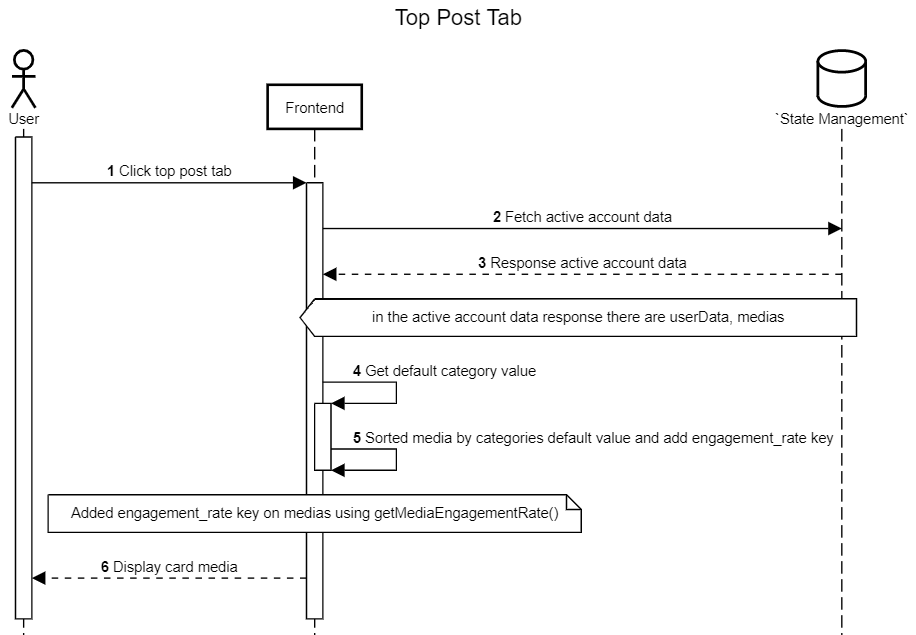

Halaman Top Post
+++++++++++++++++

Halaman ketiga pada aplikasi Toba.ai Cekbrand yang memiliki fungsi
untuk menampilkan konten-konten terbaik maupun terburuk dari tiap kategori-kategori yang 
telah ditentukan oleh aplikasi Cekbrand.Konten tersebut ditampilkan sesuai urutan peringkat berdasarkan kategori yang tersedia.

1. Pengguna menekan tab **Top Post**.
2. Frontend akan mencari data active account pada State Management.
3. State Management akan mengembalikan data yang di cari oleh frontend, terdapat `userData` dan `medias`.
4. Frontend akan mendapatkan nilai default category.
5. Pada proses ini Frontend akan melakukan sorting berdasarkan nilai category dan menambahkan key `engagement_rate` menggunakan method getMediaEngagementRate().
6. Frontend akan menampilkan card media kepada pengguna.
