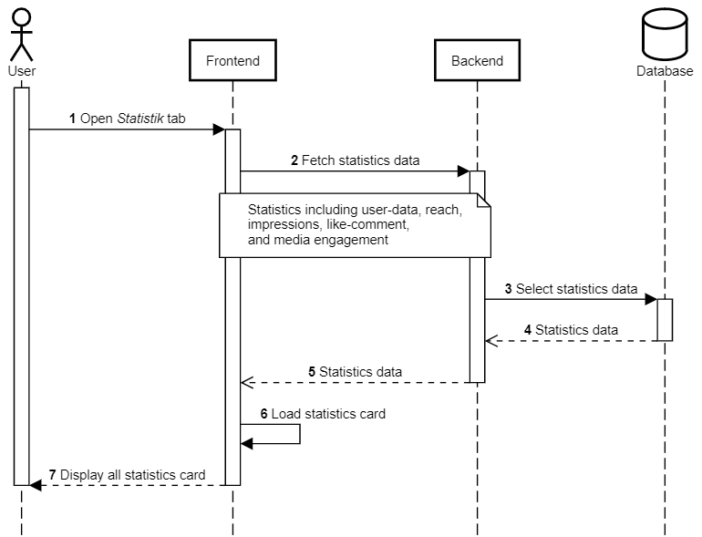

Halaman Statistik
+++++++++++++++++

Halaman kedua pada aplikasi Toba.ai Cekbrand yang memiliki fungsi untuk menampilkan analisis data performa akun Instagram berbanding waktu.
Statistik yang ditampilkan dalam halaman ini adalah statistik wawasan akun, wawasan konten, keterikatan dengan pengikut Instagram, serta data sebaran pengikut Instagram.
Terdapat pula saran-saran singkat pada setiap data grafik yang ditampilkan.
Berikut adalah diagram alur yang mewakili halaman ini.

|

Halaman Statistik terdiri dari dua bagian **Performa Akun** dan **Followers**.
Berikut adalah diagram alur yang mewakili dua bagian tersebut dan disertai dengan penjelasannya.

.. toggle-header::
    :header: **Performa Akun**

    .. figure:: ./statistic-account-sequence.png
        :scale: 50
        :align: left

    1. Pengguna membuka tab **Halaman Statistik**.
    2. Frontend melakukan request ke endpoint :ref:`user-data-summary`.
    3. Backend mengambil data dari tabel ``instagram.user_data``.
    4. Backend melakukan kalkulasi *summary*.
    5. Backend mengembalikan user-data summary.
    6. Frontend memuat dan menampilkan grafik **Follower Growth Rate**.
    7. Frontend melakukan request ke endpoint :ref:`reach-average-summary`.
    8. Backend melakukan agregat rerata data reach pada tabel ``instagram.user_insight_reach``.
    9. Backend melakukan kalkulasi *summary* rerata data reach.
    10. Backend mengembalikan data summary rerata reach.
    11. Backend melakukan request ke endpoint :ref:`impressions-list`.
    12. Backend mengambil daftar reach dari tabel ``instagram.user_insight_reach``.
    13. Backend mengembalikan daftar reach.
    14. Frontend memuat dan menampilkan grafik **Reach**.
    15. Frontend melakukan request ke endpoint :ref:`impressions-average-summary`.
    16. Backend melakukan agregat rerata data impressions pada tabel ``instagram.user_insight_impressions``.
    17. Backend melakukan kalkulasi *summary* rerata data impressions.
    18. Backend mengembalikan data summary rerata impressions.
    19. Backend melakukan request ke endpoint :ref:`impressions-list`.
    20. Backend mengambil daftar impressions dari tabel ``instagram.user_insight_impressions``.
    21. Backend mengembalikan daftar impressions.
    22. Frontend memuat dan menampilkan grafik **Impressions**.
    23. Backend melakukan request ke endpoint :ref:`engagement-list`.
    24. Backend mengambil daftar like-comment dari tabel ``instagram.media_like_comment``.
    25. Backend mengembalikan daftar like-comment.
    26. Frontend memuat dan menampilkan grafik **Engagement**.
    27. Frontend melakukan request ke endpoint :ref:`engagement-summary`.
    28. Backend melakukan agregat data engagement rate pada tabel ``instagram.user_data`` dan ``instagram.media_like_comment``.
    29. Backend mengemb`alikan data summary engagement.
    30. Frontend memuat dan menampilkan grafik **Engagement Rate**.

.. toggle-header::
    :header: **Followers**

    .. figure:: ./statistic-followers-sequence.png
        :scale: 50
        :align: left

    1. Pengguna membuka tab **Halaman Statistik**.
    2. Frontend melakukan request ke endpoint :ref:`online-followers`.
    3. Backend mengambil data insight online followers dari tabel ``instagram.user_insight_online_follower``.
    4. Backend mengembalikan daftar insight online followers.
    5. Frontend memuat dan menampilkan data online followers dalam bentuk *heatmap*.
    6. Frontend memuat dan menampilkan data top online followers dalam bentuk jadwal.
    7. Frontend melakukan request ke endpoint :ref:`audience-gender-age`.
    8. Backend mengambil daftar insight gender-age dari tabel ``instagram.user_insight_audience_gender_age``.
    9. Backend mengembalikan daftar insight gender-age.
    10. Frontend memuat dan menampilkan data persentase dan grafik gender-age.
    11. Frontend melakukan request ke endpoint :ref:`audience-country`.
    12. Backend mengambil data insight audience country dari tabel ``instagram.user_insight_audience_country``.
    13. Backend mengembalikan daftar insight audience country.
    14. Frontend melakukan pemetaan data top follower country dengan koordinat peta masing-masing.
    15. Frontend memuat dan menampilkan top follower country dalam bentuk peta dan tabel.
    16. Frontend melakukan request ke endpoint :ref:`audience-city`.
    17. Backend mengambil data insight audience city dari tabel ``instagram.user_insight_audience_city``.
    18. Backend mengembalikan data insight audience city.
    19. Frontend melakukan request data koordinat top city ke endpoint :ref:`city-coordinate`.
    20. Backend mengambil data koordinate dari file JSON.
    21. Backend mengembalikan data koordinat kota. (Proses 19-21 dilakukan sebanyak jumlah top city secara *async*).
    22. Frontend memetakan data top city dengan data koordinat masing-masing.
    23. Frontend menampilkan top follower city dalam bentuk peta dan tabel.

|