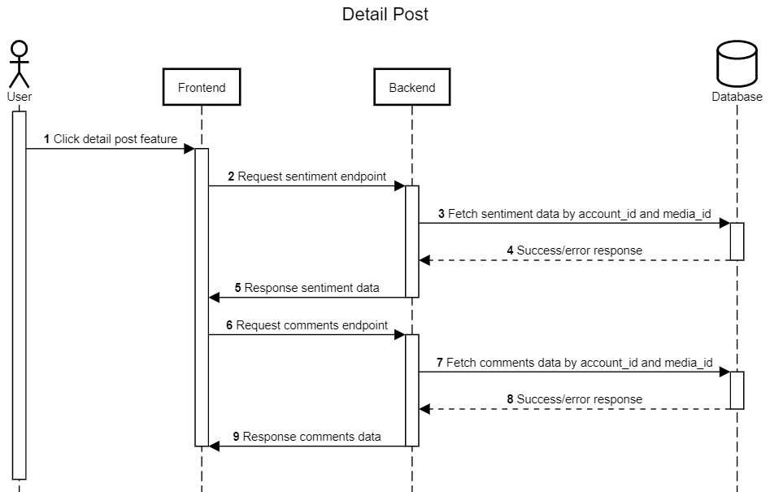

Detail Post
+++++++++++

.. _detail-post:

Fitur detail post ini merupakan fitur yang dapat 
ditemukan di aplikasi Toba.ai pada bagian tab kompetitor dan tab post. 
Fitur ini memiliki fungsi untuk melihat data sentiment dan comment pada media yang telah diposting oleh user.

1. Pengguna menekan fitur lihat post selengkapnya.
2. Frontend akan melakukan request kepada backend dengan endpoint :ref:`fetch-sentiment-media`.
3. Backend akan mencari data sentiment berdasarkan *account_id* dan *media_id* di database.
4. Backend akan mendapat response sesuai request tahap-3.
5. Backend menyampaikan response sentiment data kepada frontend.
6. Frontend akan melakukan request kepada backend dengan endpoint :ref:`fetch-comment-list`.
7. Backend akan mencari data comment berdasarkan *account_id* dan *media_id* di database.
8. Backend akan mendapat response sesuai request tahap-7.
9. Backend menyampaikan response sentiment data kepada frontend.
