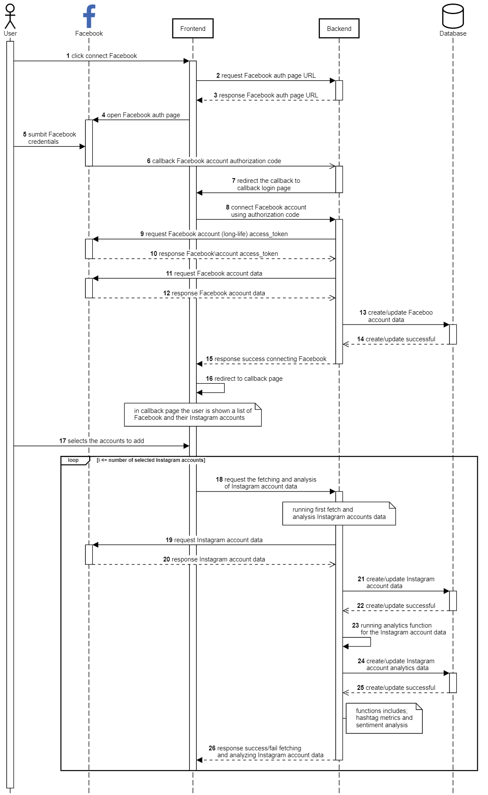

Connect Facebook
++++++++++++++++

Untuk mengolah data akun Instagram pengguna.
CekBrand membutuhkan *privilege* untuk melakukan *crawling* data pengguna melewati Facebook Graph API.
Privilege didapatkan melalui rangkaian otorisasi akun Facebook pengguna dengan layanan CekBrand atau yang disebut dengan **connect Facebook**.
Berikut adalah diagram alur yang mewakili usecase ini disertai penjelasannya.

1. Pengguna melakukan request connect Facebook pada halaman **Depan** atau **Kelola Akun**
2. Frontend melakukan request :ref:`fb-auth-login`.
3. Backend mengembalikan URL untuk menuju halaman otentikasi Facebook.
4. Frontend membuka halaman otentikasi Facebook dengan alamat tersebut.
5. Pengguna mengisi formulir otentikasi Facebook.
6. Facebook melakukan *callback* dengan menyertakan kode otentikasi ke alamat :ref:`fb-auth-callback`.
7. Backend mengalihkan rute ke halaman **Callback Login**
8. Frontend menggunakan endpoint :ref:`fb-auth-login-callback` untuk connect Facebook menggunakan kode otorisasi.
9. Backend meminta *access token* ke Facebook API menggunakan kode tersebut.
10. Facebook mengembalikan *access token* yang bersifat *long-term*.
11. Backend menggunakan access token yang didapatkan sebelumnya untuk melakukan request data akun Facebook pengguna.
12. Facebook mengembalikan data akun Facebook pengguna.
13. Backend menyimpan data akun Facebook pengguna tersebut ke dalam database.
14. Backend menginfokan ke Frontent bahwa proses connect facebook berhasil.
15. Frontend mengalihkan pengguna ke halaman **Kelola Akun**.
16. Pengguna memilih akun Instagram yang akan dihubungkan ke CekBrand Dashboard.
17. Frontend menggunakan endpoint :ref:`fetch-ig-data` untuk melakuakn request mengambilan data akun Instagram pengguna.
18. Backend melakuakn request data akun Instagram pengguna ke Facebook API.
19. Facebook mengembalikan data akun Instagram tersebut.
20. Backend menyimpan data akun Instagram tersebut ke database.
21. Backend menjalankan fungsi analitik untuk akun Instagram tersebut.
22. Backend menyimpan data hasil analitik ke database.
23. Backend menginformasikan bahwa proses akuisisi data akun Instagram berhasil.
24. Proses 17-23 dilakukan sebanyak akun Instagram yang dipilih.