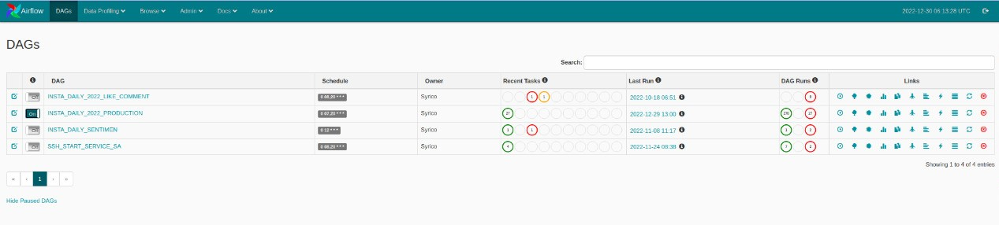
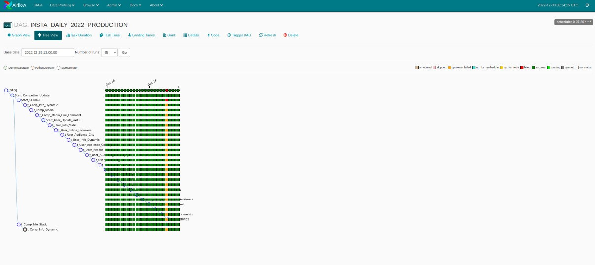
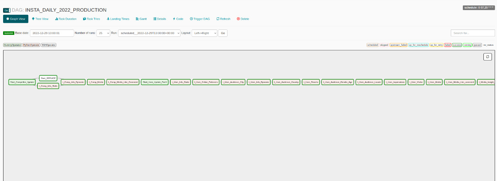

# Arsitektur

Arsitektur airflow yang digunakan terdiri dari komponen-komponen berikut.

- **Scheduler**, yang menangani pemicuan workflow terjadwal, dan mengirimkan task ke pelaksana untuk dijalankan.
- **Executor**, yang menangani tugas yang sedang berjalan. Dalam penginstalan airflow default, ini menjalankan semua yang ada di dalam scheduler, tetapi sebagian besar executor yang cocok untuk produksi sebenarnya mendorong eksekusi tugas ke workers. Jenis executor yang digunakan adalah LocalExecutor, yang dapat menerima parameter parallelisme untuk melimitasi jumlah proses yang dimunculkan.
- **Webserver**, yang menyajikan user interface untuk memeriksa, memicu, dan men-debug perilaku DAG dan tugas. Tampilan webserver dapat dilihat sebagai berikut.

- **Folder file DAG**, dibaca oleh scheduler dan executor (dan semua pekerja yang dimiliki pelaksana)
- **Database metadata**, digunakan oleh scheduler, executor, dan webserver untuk menyimpan status.
