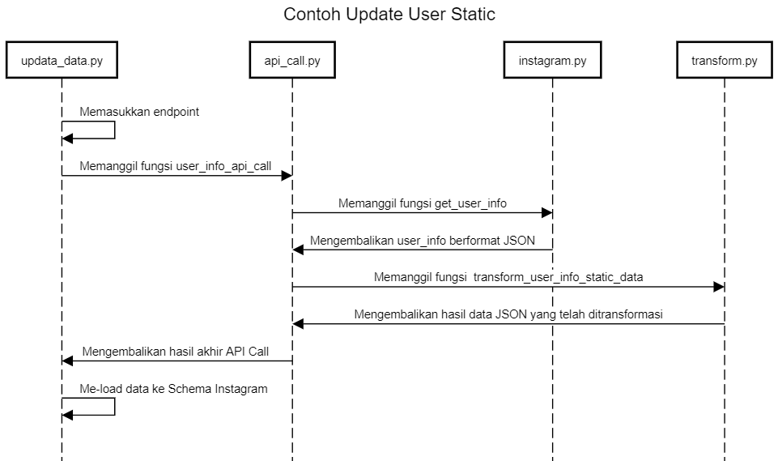

# API Call
Pada bagian ini, diberikan list nama-nama fungsi yang digunakan dalam proses pemanggilan API Call. Sebelum itu, akan diberikan salah satu contoh visualisai proses ETL melakukan update user static sebagai berikut.

## Contoh Update User Static

Misalnya akan diambil data user (static) di Schema Instagram, maka pertama di update_data.py, kita masukkan endpoint untuk mengupdate data. Selanjutnya, update.py akan memanggil fungsi user_info_api_call dari file api_call.py, yang akan membutuhkan user id token argumen true/false. Lalu dari user_info_api_call, fungsi akan memanggil third party yakni fungsi get_user_info. Dari get_user_info, fungsi mengembalikan data berformat JSON dan setelah itu, terjadi proses transformasi dengan memanggil fungsi transform_user_info_static_data yang ada di file transform.py di folder utils. Hasil transformasi itulah yang akan dimasukkan melalui update.py ke Schema Instagram berupa data user. Langkah di atas dapat divisualisasikan sebagai berikut. 

Nama-nama fungsi yang diperlukan dalam proses ETL dapat dilihat lebih lanjut sebagai berikut.

## User

| update_data.py               | api_call.py                    | instagram.py (function) | instagram.py (metrics/fields)   | transform.py                  |  Schema Instagram                |
|------------------------------|--------------------------------|-------------------------|---------------------------------|-------------------------------|----------------------------------|
| update user static           | user_info_api_call             | get_user_info     | fields = None                   | transform_user_info_static_data        | user                             |
| update user dynamic          | user_info_api_call             | get_user_info     | fields = None                   | transform_user_info_dynamic_data       | user_data                        |
| update user media            | user_medias_api_call           | get_user_medias   | fields = None                   | transform_media_dataDev                | media                            |
| update user audience city    | user_audience_api_call         | get_user_insights | metrics = ‘audience_city’       | transform_user_audience_city           | user_insight_audience_city       |
| update user audience country | user_audience_api_call         | get_user_insights | metrics = ‘audience_country’    | transform_user_audience_country_locale | user_insight_audience_country    |
| update user gender and age   | user_audience_api_call         | get_user_insights | metrics = ‘audience_gender_age’ | transform_user_audience_gender_age     | user_insight_audience_gender_age |
| update user audience locale  | user_audience_api_call         | get_user_insights | metrics = ‘audience_locale’     | transform_user_audience_country_locale | user_insight_audience_locale     |
| update user online followers | user_online_followers_api_call | get_user_insights | metrics = ‘online_followers’    | transform_online_followers             | user_insight_online_follower     |
| update user impression       | user_impression_reach_api_call | get_user_insights | metrics = ‘impression’          | transform_user_impressions_reach       | user_insight_reach               |
| update user reach            | user_impression_reach_api_cal  | get_user_insights | metrics = ‘reach’               | transform_user_impressions_reach       | user_insight_impression          |

## Competitor

| update_data.py      | api_call.py                | instagram.py (function)  | instagram.py (metrics/fields) | transform.py                  |  Schema   Instagram |
|---------------------|----------------------------|-----------------------|----------------|----------------------------------|-----------|
| update comp static  | competitor_info_api_call   | discovery_user        | fields = None  |  transform_user_info_static_data | user      |
| update comp dynamic | competitor_info_api_call   | discovery_user        | fields = None  | transform_user_info_dynamic_data | user_data |
| update comp media   | competitor_medias_api_call | discovery_user_medias | fields = None  | transform_media_dataDev          | media     |

## Media Insight

| update_data.py       | api_call.py                  | instagram.py (function)  | instagram.py (metrics/fields)                                                                                                                                                                                                                                                                                               | transform.py                  |Schema   Instagram |
|----------------------|------------------------------|-----------------------|--------------------------------------------------------------------------------------------------------------------------------------------------------------------------------------------------------------------------------------------------------------------------------------------------------------------------|-------------------------------|--------------------|
| update media insight | user_media_insights_api_call | get_media_insights    | image_metric = ['engagement',   'reach', 'impressions', 'saved']  video_metric = ['engagement', 'reach', 'impressions', 'saved',   'video_views']   album_metric = ['carousel_album_engagement', 'carousel_album_impressions',   'carousel_album_reach',    'carousel_album_saved', 'carousel_album_video_views'] |transform_media_insight       | media_insight      |
| update media comment | user_media_comment_api_call  | get_comments_by_media | fields = None                                                                                                                                                                                                                                                                                                            |transform_comment             | media_comments     |
