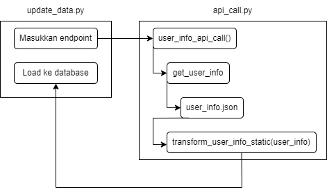

# Pengertian dan Langkah-Langkah

ETL adalah singkatan dari  **Extract, Transform, and Load**. ETL ini diperlukan untuk menyentralisasi data dari berbagai sumber ke satu database.

## Extract

Untuk dapat mengambil data, terlebih dahulu memasukkan endpoint untuk meng-update data, yang dilakukan di update_data.py. Selanjutnya, update.py akan memanggil fungsi API yang diperlukan dari file api_call.py. Fungsi tersebut memerlukan user id token argumen true/false. Kemudian, fungsi tersebut akan memanggil fungsi third party. Dengan fungsi tersebut, barulah diperoleh ekstraksi data dalam format JSON.

## Transform

Selanjutnya, dilakukan transformasi data secara batch (paralel). Pertama-tama, format data JSON akan ditransformasikan ke dalam dictionary (key value), di mana key sesuai dengan kolom tabel tujuan. Proses ini dilakukan dengan memanggil fungsi transform dari file transform.py yang tersedia di folder utils. Dalam proses transformasi, dilakukan splitting data, pengaturan penulisan waktu dan rentang waktu, dll. Untuk media comment, akan digunakan untuk proses sentimen analisis lebih lanjut oleh data scientist baru agar diperoleh data sentimen.

## Load

Terakhir, dilakukan pemindahan data yang telah ditransformasi ke destinasi baru, yaitu Schema Instagram dan Schema Toba_Cek_Insta.

## Contoh Aplikasi

Misalnya akan diambil data user (static) di Schema Instagram, maka pertama di update_data.py, kita masukkan endpoint untuk mengupdate data. Selanjutnya, update.py akan memanggil fungsi user_info_api_call dari file api_call.py, yang akan membutuhkan user id token argumen true/false. Lalu dari user_info_api_call, fungsi akan memanggil third party yakni fungsi get_user_info. Dari get_user_info, fungsi mengembalikan data berformat JSON dan setelah itu, terjadi proses transformasi dengan memanggil fungsi transform_user_info_static_data yang ada di file transform.py di folder utils. Hasil transformasi itulah yang akan dimasukkan melalui update.py ke Schema Instagram berupa data user. Langkah di atas dapat divisualisasikan sebagai berikut.

Nama-nama fungsi yang diperlukan dalam proses ETL dapat dilihat lebih lanjut pada [API Call](/Toba/cekbrand/dwarehouse/etl/api).
