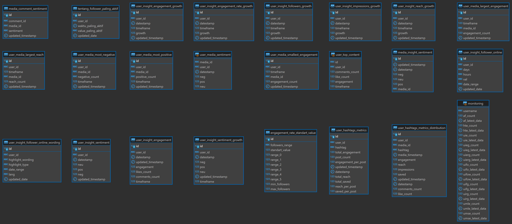

# Schema Toba_Cek_Insta

Berisi tentang data olahan analytics dari data awal instagram.

## Schema User

### ``user_insight_engagement``

Berisi data nilai engagement yang diperoleh dari penambahan jumlah like dan jumlah comment untuk setiap user dengan periode waktu 7 hari dan 28 hari.
| Nama Kolom        | Tipe        | Tipe Data | Isi                                               | Catatan         |
|-------------------|-------------|-----------|---------------------------------------------------|-----------------|
| id                | Primary Key | serial    | Nomor ID                                          |                 |
| user_id           | Foreign Key | varchar   | Nomor ID yang merujuk pada table user             | Unique          |
| engagement        | -           | int       | Nilai engagement untuk suatu user                 |                 |
| likes_count       | -           | int       | Jumlah like pada suatu user                       |                 |
| comments_count    | -           | int       | Jumlah komentar pada suatu user                   |                 |
| timeframe         | -           | int       | Periode waktu (dalam hari) perhitungan engagement | [7, 28], Unique |
| datestamp         | -           | date      | datestamp kapan data di update                    | Unique          |
| updated_timestamp | -           | timestamp | Timestamp kapan data di update                    |                 |

### ``user_insight_engagement_growth``

Berisi data nilai growth engagement dengan perhitungan nilai engagement pada hari ini dibandingkan dengan 7 hari atau 28 hari yang lalu untuk setiap user.

| Nama Kolom        | Tipe        | Tipe Data | Isi                                                      | Catatan |
|-------------------|-------------|-----------|----------------------------------------------------------|---------|
| id                | Primary Key | bigserial | Nomor ID                                                 |         |
| user_id           | Foreign Key | varchar   | Nomor ID yang merujuk pada table user                    |         |
| growth            | -           | float     | Nilai engagement growth untuk suatu user                 |         |
| timeframe         | -           | int       | Periode waktu (dalam hari) perhitungan engagement growth | [7, 28] |
| datestamp         | -           | date      | datestamp kapan data di update                           |         |
| updated_timestamp | -           | timestamp | Timestamp kapan data di update                           |         |

### ``user_insight_engagement_rate_growth``

Berisi data nilai rate growth engagement dengan perhitungan nilai engagement pada hari ini dibagi jumlah follower dibandingkan dengan nilai 7 hari atau 28 hari yang lalu untuk setiap user.

| Nama Kolom        | Tipe        | Tipe Data | Isi                                                           | Catatan |
|-------------------|-------------|-----------|---------------------------------------------------------------|---------|
| id                | Primary Key | bigserial | Nomor ID                                                      |         |
| user_id           | Foreign Key | varchar   | Nomor ID yang merujuk pada table user                         |         |
| growth            | -           | float     | Nilai engagement rate growth untuk suatu user                 |         |
| timeframe         | -           | int       | Periode waktu (dalam hari) perhitungan engagement rate growth | [7, 28] |
| datestamp         | -           | date      | datestamp kapan data di update                                |         |
| updated_timestamp | -           | timestamp | Timestamp kapan data di update                                |         |

### ``user_insight_follower_online``

Berisi tentang data insight sebaran jam online follower dari suatu user.

| Nama Kolom   | Tipe        | Tipe Data | Isi                                   | Catatan |
|--------------|-------------|-----------|---------------------------------------|---------|
| id           | Primary Key | varchar   | Nomor ID                              |         |
| user_id      | Foreign Key | varchar   | Nomor ID yang merujuk pada table user |         |
| hours        | -           | varchar   | Rentang Jam dari 0-24                 |         |
| val          | -           | varchar   | Nilai Impression user                 |         |
| date_range   | -           | varchar   | Range tanggal penghitungan            |         |
| updated_date | -           | timestamp | Timestamp kapan data di update        |         |

### ``user_insight_follower_growth``

Berisi data nilai growth jumlah follower dengan perhitungan nilai pada hari ini dibandingkan dengan nilai 7 hari atau 28 hari yang lalu untuk setiap user.

| Nama Kolom        | Tipe        | Tipe Data | Isi                                             | Catatan  |
|-------------------|-------------|-----------|-------------------------------------------------|----------|
| id                | Primary Key | serial    | Nomor ID                                        |          |
| user_id           | Foreign Key | varchar   | Nomor ID yang merujuk pada table user           |          |
| date_stamp        | -           | date      | tanggal kapan data di update                    |          |
| timeframe         | -           | int       | Periode waktu perhitungan perbandingan follower | [7 , 28] |
| growth            | -           | float     | Nilai growth follower setiap user               |          |
| updated_timestamp | -           | timestamp | Timestamp kapan data di update                  |          |

### ``user_insight_impressions_growth``

Berisi data nilai growth impression user dengan perhitungan nilai pada hari ini dibandingkan dengan nilai 7 hari atau 28 hari yang lalu untuk setiap user.

| Nama Kolom        | Tipe        | Tipe Data | Isi                                             | Catatan  |
|-------------------|-------------|-----------|-------------------------------------------------|----------|
| id                | Primary Key | serial    | Nomor ID                                        |          |
| user_id           | Foreign Key | varchar   | Nomor ID yang merujuk pada table user           |          |
| date_stamp        | -           | date      | tanggal kapan data di update                    |          |
| timeframe         | -           | int       | Periode waktu perhitungan perbandingan follower | [7 , 28] |
| growth            | -           | float     | Nilai growth impressions setiap user            |          |
| updated_timestamp | -           | timestamp | Timestamp kapan data di update                  |          |

### ``user_insight_reach_growth``

Berisi data nilai growth jumlah reach user dengan perhitungan nilai pada hari ini dibandingkan dengan nilai 7 hari atau 28 hari yang lalu untuk setiap user.

| Nama Kolom        | Tipe        | Tipe Data | Isi                                             | Catatan  |
|-------------------|-------------|-----------|-------------------------------------------------|----------|
| id                | Primary Key | serial    | Nomor ID                                        |          |
| user_id           | Foreign Key | varchar   | Nomor ID yang merujuk pada table user           |          |
| date_stamp        | -           | date      | tanggal kapan data di update                    |          |
| timeframe         | -           | int       | Periode waktu perhitungan perbandingan follower | [7 , 28] |
| growth            | -           | float     | Nilai growth impressions setiap user            |          |
| updated_timestamp | -           | timestamp | Timestamp kapan data di update                  |          |

### ``user_insight_sentiment``

Berisi data nilai sentiment user (positif, negatif, dan netral) dari komentar pada media suatu user.

| Nama Kolom        | Tipe        | Tipe Data | Isi                                   | Catatan |
|-------------------|-------------|-----------|---------------------------------------|---------|
| id                | Primary Key | serial    | Nomor ID                              |         |
| user_id           | Foreign Key | varchar   | Nomor ID yang merujuk pada table user |         |
| date_stamp        | -           | date      | tanggal kapan data di update          |         |
| neu               | -           | int       | Jumlah sentiment netral               |         |
| pos               | -           | int       | Jumlah sentiment positive             |         |
| neg               |             | int       | Jumlah sentiment negative             |         |
| updated_timestamp | -           | timestamp | Timestamp kapan data di update        |         |

### ``user_insight_sentiment_growth``

Berisi data nilai growth setiap sentiment dengan melakukan penguragan nilai pada hari ini dibandingkan dengan nilai 7 hari atau 28 hari yang lalu untuk setiap user.

| Nama Kolom        | Tipe        | Tipe Data | Isi                                              | Catatan  |
|-------------------|-------------|-----------|--------------------------------------------------|----------|
| id                | Primary Key | serial    | Nomor ID                                         |          |
| user_id           | Foreign Key | varchar   | Nomor ID yang merujuk pada table user            |          |
| date_stamp        | -           | date      | tanggal kapan data di update                     |          |
| neu               | -           | float     | Jumlah growth sentiment netral                   |          |
| pos               | -           | float     | Jumlah growth sentiment positive                 |          |
| neg               |             | float     | Jumlah growth sentiment negative                 |          |
| updated_timestamp | -           | timestamp | Timestamp kapan data di update                   |          |
| timeframe         | -           | int       | Periode waktu perhitungan perbandingan sentiment | [7 , 28] |

## Schema Media

### ``user_media_largest_engagement``

Berisi data media yang memiliki nilai engagement terbanyak pada suatu user dengan periode waktu 7 atau 28 hari.

| Nama Kolom        | Tipe        | Tipe Data | Isi                                            | Catatan  |
|-------------------|-------------|-----------|------------------------------------------------|----------|
| id                | Primary Key | bigserial | Nomor ID                                       |          |
| user_id           | Foreign Key | varchar   | Nomor ID yang merujuk pada table user          |          |
| media_id          | Foreign Key | varchar   | Nomor ID yang merujuk pada table media         |          |
| timeframe         | -           | int       | Periode waktu perhitungan engagement terbanyak | [7 , 28] |
| engagement_count  | -           | int       | Jumlah engagement media                        |          |
| updated_timestamp | -           | timestamp | Timestamp kapan data di update                 |          |

### ``user_media_largest_reach``

Berisi data media yang memiliki nilai reach terbanyak pada suatu user dengan periode waktu 7 atau 28 hari.

| Nama Kolom        | Tipe        | Tipe Data | Isi                                            | Catatan  |
|-------------------|-------------|-----------|------------------------------------------------|----------|
| id                | Primary Key | bigserial | Nomor ID                                       |          |
| user_id           | Foreign Key | varchar   | Nomor ID yang merujuk pada table user          |          |
| media_id          | Foreign Key | varchar   | Nomor ID yang merujuk pada table media         |          |
| timeframe         | -           | int       | Periode waktu perhitungan engagement terbanyak | [7 , 28] |
| reach_count       | -           | int       | Jumlah reach suatu media                       |          |
| updated_timestamp | -           | timestamp | Timestamp kapan data di update                 |          |

### ``user_media_most_negative``

Berisi data media yang memiliki sentiment negatif terbanyak pada suatu user dengan periode waktu 7 atau 28 hari.

| Nama Kolom        | Tipe        | Tipe Data | Isi                                            | Catatan  |
|-------------------|-------------|-----------|------------------------------------------------|----------|
| id                | Primary Key | bigserial | Nomor ID                                       |          |
| user_id           | Foreign Key | varchar   | Nomor ID yang merujuk pada table user          |          |
| media_id          | Foreign Key | varchar   | Nomor ID yang merujuk pada table media         |          |
| timeframe         | -           | int       | Periode waktu perhitungan engagement terbanyak | [7 , 28] |
| negative_count    | -           | int       | Jumlah sentiment negatif suatu media           |          |
| updated_timestamp | -           | timestamp | Timestamp kapan data di update                 |          |

### ``user_media_most_positive``

Berisi data media yang memiliki sentiment positif terbanyak pada suatu user dengan periode waktu 7 atau 28 hari.

| Nama Kolom        | Tipe        | Tipe Data | Isi                                            | Catatan  |
|-------------------|-------------|-----------|------------------------------------------------|----------|
| id                | Primary Key | bigserial | Nomor ID                                       |          |
| user_id           | Foreign Key | varchar   | Nomor ID yang merujuk pada table user          |          |
| media_id          | Foreign Key | varchar   | Nomor ID yang merujuk pada table media         |          |
| timeframe         | -           | int       | Periode waktu perhitungan engagement terbanyak | [7 , 28] |
| positive_count    | -           | int       | Jumlah sentiment positive suatu media          |          |
| updated_timestamp | -           | timestamp | Timestamp kapan data di update                 |          |

### ``user_media_smallest_engagement``

Berisi data media yang memiliki nilai engagement paling sedikit pada suatu user dengan periode waktu 7 atau 28 hari.

| Nama Kolom        | Tipe        | Tipe Data | Isi                                            | Catatan  |
|-------------------|-------------|-----------|------------------------------------------------|----------|
| id                | Primary Key | bigserial | Nomor ID                                       |          |
| user_id           | Foreign Key | varchar   | Nomor ID yang merujuk pada table user          |          |
| media_id          | Foreign Key | varchar   | Nomor ID yang merujuk pada table media         |          |
| timeframe         | -           | int       | Periode waktu perhitungan engagement terbanyak | [7 , 28] |
| engagement_count  | -           | int       | Jumlah engagement media                        |          |
| updated_timestamp | -           | timestamp | Timestamp kapan data di update                 |          |

### ``user_media_comment_sentiment``

Berisi data sentiment setiap komentar pada suatu media.

| Nama Kolom        | Tipe        | Tipe Data | Isi                                      | Catatan          |
|-------------------|-------------|-----------|------------------------------------------|------------------|
| id                | Primary Key | bigserial | Nomor ID                                 |                  |
| comment_id        | Foreign Key | varchar   | Nomor ID yang merujuk pada table comment |                  |
| media_id          | Foreign Key | varchar   | Nomor ID yang merujuk pada table media   |                  |
| sentiment         | -           | varchar   | Sentiment komentar suatu media           | [neu , pos, neg] |
| updated_timestamp | -           | timestamp | Timestamp kapan data di update           |                  |

## Schema Lainnya

### ``user_hastags_metrics``

Berisi data metrics setiap hashtag pada suatu media user.

| Nama Kolom          | Tipe        | Tipe Data   | Isi                                                         | Catatan          |
|---------------------|-------------|-------------|-------------------------------------------------------------|------------------|
| id                  | Primary Key | serial      | Nomor ID                                                    |                  |
| user_id             | Foreign Key | varchar     | Nomor ID yang merujuk pada table user                       | Unique           |
| hastag              | -           | timestamptz | Hastag yang tertera pada caption (#Hastag)                  | Unique           |
| total_engagement    | -           | int         | Jumlah engagement                                           | [neu , pos, neg] |
| post_count          | -           | int         | Jumlah post yang menggunakan hastag tertentu                |                  |
| engagement_per_post |             | float       | Perhitungan engagement dibagi jumlah postingan              |                  |
| updated_timestamp   |             | timestamptz | Timestamp kapan data di update                              |                  |
| datestamp           |             | date        | Date kapan data di update                                   | Unique           |
| total_reach         |             | int         | Jumlah total reach                                          |                  |
| total_saved         |             | int         | Jumlah total post yang di simpan dengan menggunakan hastag  |                  |
| reach_per_post      |             | int         | Penghitungan reach per jumlah post                          |                  |
| saved_per_post      |             | int         | Penghitungan media disimpan per jumlah post                 |                  |

### ``user_hastags_metrics_distribution``

Berisi data distribusi metrics setiap hashtag pada suatu media user.

| Nama Kolom        | Tipe        | Tipe Data   | Isi                                            | Catatan |
|-------------------|-------------|-------------|------------------------------------------------|---------|
| id                | Primary Key | serial      | Nomor ID                                       |         |
| user_id           | Foreign Key | varchar     | Nomor ID yang merujuk pada table user          |         |
| media_id          | Foreign Key | varchar     | Nomor ID yang merujuk pada table media         | Unique  |
| hastag            | -           | timestamptz | Hastag yang tertera pada caption (#Hastag)     | Unique  |
| media_timestamp   |             | timestamptz | Timestamp kapan media di update                | Unique  |
| engagement        |             | int4        | Perhitungan engagement dibagi jumlah postingan |         |
| reach             | -           | int4        | Jumlah reach post                              |         |
| impressions       |             | int4        | Jumlah impressions                             |         |
| updated_timestamp |             | timestamptz | Timestamp kapan data di update                 |         |
| datestamp         |             | date        | Date kapan data di update                      | Unique  |
| comments_count    |             | int         | Jumlah komentar pada suatu media               |         |
| like_count        |             | int         | Jumlah Like pada suatu media                   |         |

### ``user_insight_follower_online_wording (not active)``

Berisi data insight.

| Nama Kolom        | Tipe        | Tipe Data | Isi                                   | Catatan |
|-------------------|-------------|-----------|---------------------------------------|---------|
| id                | Primary Key | serial    | Nomor ID                              |         |
| user_id           | Foreign Key | varchar   | Nomor ID yang merujuk pada table user |         |
| highlight_wording | -           | varchar   |                                       |         |
| highlight_type    | -           | varchar   |                                       |         |
| date_range        | -           | date      | datestamp kapan data di update        |         |
| lang              | -           | varchar   | bahasa yang digunakan                 |         |
| updated_date      | -           | timestamp | Timestamp kapan data di update        |         |

### ``user_media_comment_sentiment (not active)``

Berisi data waktu paling aktif suatu user.

| Nama Kolom         | Tipe        | Tipe Data   | Isi                                   | Catatan |
|--------------------|-------------|-------------|---------------------------------------|---------|
| id                 | Primary Key | serial      | Nomor ID                              |         |
| user_id            | Foreign Key | varchar     | Nomor ID yang merujuk pada table user |         |
| waktu_paling_aktif | -           | timestamptz |                                       |         |
| value_paling_aktif | -           | varchar     |                                       |         |
| updated_date       | -           | timestamp   | Timestamp kapan data di update        |         |

Berisi tentang data insight sebaran jam online follower dari suatu user.

| Nama Kolom   | Tipe        | Tipe Data | Isi                                   | Catatan |
|--------------|-------------|-----------|---------------------------------------|---------|
| id           | Primary Key | varchar   | Nomor ID                              |         |
| user_id      | Foreign Key | varchar   | Nomor ID yang merujuk pada table user |         |
| hours        | -           | varchar   | Rentang Jam dari 0-24                 |         |
| val          | -           | varchar   | Nilai Impression user                 |         |
| date_range   | -           | varchar   | Range tanggal penghitungan            |         |
| updated_date | -           | timestamp | Timestamp kapan data di update        |         |
