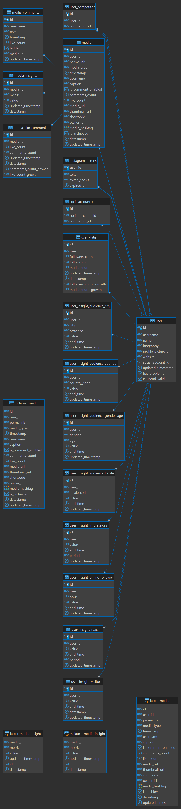

# Schema Instagram

Berisi tentang data yang diambil dari instagram seperti data user, data media, dan  data-data insight dari API instagram.

## Schema User

### ``user``

Berisi tentang data user yang diambil dari instagram.

| Nama Kolom          | Tipe        | Tipe Data | Isi                                                                                                 | Catatan |
|---------------------|-------------|-----------|-----------------------------------------------------------------------------------------------------|---------|
| id                  | Primary Key | varchar   | Nomor ID User                                                                                       |         |
| username            | -           | varchar   | Username instagram                                                                                  |         |
| name                | -           | varchar   | Display name user                                                                                   |         |
| biography           | -           | varchar   | Biography user                                                                                      |         |
| profile_picture_url | -           | varchar   | Alamat Url Profil Picture                                                                           |         |
| website             | -           | varchar   | Alamat website user                                                                                 |         |
| social_account_id   | Foreign Key | int       | Id Facebook fans page                                                                               |         |
| updated_timestamp   | -           | timestamp | Timestamp kapan data di update                                                                      |         |
| has_problems        | -           | bool      | Keterangan apakah user bermasalah                                                                   |         |
| is_userid_valid     | -           | bool      | Keterangan apakah user id tersebut valid, ditandai dengan bisa/tidaknya akun tersebut mereturn data |         |

### ``user_data``

Berisi tentang data user dengan atribut sosial media di instagram seperti jumlah follower, jumlah media (foto/video).

| Nama Kolom             | Tipe        | Tipe Data | Isi                                                                                                 | Catatan |
|------------------------|-------------|-----------|-----------------------------------------------------------------------------------------------------|---------|
| id                     | Primary Key | int       | Nomor Id                                                                                            |         |
| user_id                | Foreign Key | varchar   | Nomor ID pada tabel user                                                                            |         |
| followers_count        | -           | int       | Jumlah user follower                                                                                |         |
| follows_count          | -           | int       | Jumlah user following                                                                               |         |
| media_count            | -           | int       | Jumlah media yang diupload user                                                                     |         |
| updated_timestamp      | -           | timestamp | Timestamp kapan data di update                                                                      | Unique  |
| datestamp              | -           | date      | Datestamp kapan data di update                                                                      | Unique  |
| followers_count_growth | -           | int4      | Pertumbuhan jumlah followers                                                                        |         |
| media_count_growth     | -           | int4      | Pertumbuhan jumlah media/postingan                                                                  |         |

### ``user_competitor``

Berisi tentang data id user dengan id user competitor.

| Nama Kolom    | Tipe        | Tipe Data | Isi                                                                             | Catatan |
|---------------|-------------|-----------|---------------------------------------------------------------------------------|---------|
| id            | Primary Key | serial    | Nomor Id                                                                        |         |
| user_id       | Foreign Key | varchar   | Nomor ID yang merujuk pada table user                                           |         |
| competitor_id | Foreign Key | varchar   | Nomor ID yang merujuk pada table user yang merupakan kompetitor dari suatu user |         |

### ``user_insight_audience_city``

Berisi tentang data insight kota & provinsi dari follower suatu user.

| Nama Kolom | Tipe        | Tipe Data | Isi                                               | Catatan |
|------------|-------------|-----------|---------------------------------------------------|---------|
| id         | Primary Key | bigserial | Nomor ID                                          |         |
| user_id    | Foreign Key | varchar   | Nomor ID yang merujuk pada table user             |         |
| city       | -           | varchar   | Nama Kota                                         |         |
| province   | -           | varchar   | Nama Province                                     |         |
| value      | -           | int       | Jumlah follower dengan kota dan provinsi tertentu |         |

### ``user_insight_audience_country``

Berisi tentang data insight sebaran negara follower suatu user.

| Nama Kolom        | Tipe        | Tipe Data | Isi                                    | Catatan |
|-------------------|-------------|-----------|----------------------------------------|---------|
| id                | Primary Key | bigserial | Nomor ID                               |         |
| user_id           | Foreign Key | varchar   | Nomor ID yang merujuk pada table user  |         |
| country_code      | -           | varchar   | Kode Negara                            |         |
| value             | -           | int       | Jumlah follower dengan negara tertentu |         |
| end_time          | -           | timestamp | Datestamp data update dari facebook    |         |
| updated_timestamp | -           | timestamp | Timestamp kapan data di update         |         |

### ``user_insight_audience_gender_age``

Berisi tentang data insight sebaran jenis kelamin dan range usia follower dari suatu user.
| Nama Kolom        | Tipe        | Tipe Data | Isi                                                          | Catatan |
|-------------------|-------------|-----------|--------------------------------------------------------------|---------|
| id                | Primary Key | bigserial | Nomor ID                                                     |         |
| user_id           | Foreign Key | varchar   | Nomor ID yang merujuk pada table user                        |         |
| gender            | -           | varchar   | Jenis kelamin user                                           |         |
| age               | -           | varchar   | Range usia user                                              |         |
| value             | -           | int       | Jumlah follower dengan jenis kelamin dan range usia tertentu |         |
| end_time          | -           | timestamp | Datestamp data update dari facebook                          |         |
| updated_timestamp | -           | timestamp | Timestamp kapan data di update                               |         |

### ``user_insight_audience_locale``

Berisi tentang data insight sebaran *ISO Language Code* follower dari suatu user.

| Nama Kolom        | Tipe        | Tipe Data | Isi                                         | Catatan |
|-------------------|-------------|-----------|---------------------------------------------|---------|
| id                | Primary Key | bigserial | Nomor ID                                    |         |
| user_id           | Foreign Key | varchar   | Nomor ID yang merujuk pada table user       |         |
| locale_code       | -           | varchar   | Kode Bahasa                                 |         |
| value             | -           | int       | Jumlah follower dengan kode bahasa tertentu |         |
| end_time          | -           | timestamp | Datestamp data update dari facebook         |         |
| updated_timestamp | -           | timestamp | Timestamp kapan data di update              |         |

### ``user_insight_impressions``

Berisi tentang data insight impression follower dari suatu user.

| Nama Kolom        | Tipe        | Tipe Data | Isi                                   | Catatan             |
|-------------------|-------------|-----------|---------------------------------------|---------------------|
| id                | Primary Key | bigserial | Nomor ID                              |                     |
| user_id           | Foreign Key | varchar   | Nomor ID yang merujuk pada table user |                     |
| period            | -           | varchar   | Periode Perhitungan Impressions       | [Day, Week, Day28]  |
| value             | -           | int       | Nilai Impression user                 |                     |
| end_time          | -           | timestamp | Datestamp data update dari facebook   |                     |
| updated_timestamp | -           | timestamp | Timestamp kapan data di update        |                     |

### ``user_insight_online_follower``

Berisi tentang data insight sebaran jam online follower dari suatu user.

| Nama Kolom        | Tipe        | Tipe Data | Isi                                            | Catatan |
|-------------------|-------------|-----------|------------------------------------------------|---------|
| id                | Primary Key | int       | Nomor ID                                       |         |
| user_id           | Foreign Key | varchar   | Nomor ID yang merujuk pada table user          |         |
| hour              | -           | int       | Rentang Jam dari 0-24                          |         |
| value             | -           | int       | Nilai jumlah online follower pada jam tertentu |         |
| end_time          | -           | timestamp | Datestamp data update dari facebook            |         |
| updated_timestamp | -           | timestamp | Timestamp kapan data di update                 |         |

### ``user_insight_reach``

Berisi tentang data insight nilai reach dari suatu user.

| Nama Kolom        | Tipe        | Tipe Data | Isi                                                         | Catatan             |
|-------------------|-------------|-----------|-------------------------------------------------------------|---------------------|
| id                | Primary Key | bigserial | Nomor ID                                                    |                     |
| user_id           | Foreign Key | varchar   | Nomor ID yang merujuk pada table user                       |                     |
| period            | -           | varchar   | Periode Perhitungan Reach                                   | [Day, Week, Day28]  |
| value             | -           | int       | Jumlah nilai Reach user                                     |                     |
| end_time          | -           | timestamp | Datestamp data dihitung dari tanggal berapa (dari facebook) |                     |
| updated_timestamp | -           | timestamp | Timestamp kapan data di update                              |                     |

## Schema Media

### ``media``

Berisi tentang data media (foto/video) setiap user.

| Nama Kolom         | Tipe        | Tipe Data   | Isi                                          | Catatan                        |
|--------------------|-------------|-------------|----------------------------------------------|--------------------------------|
| id                 | Primary Key | varchar     | Nomor ID                                     | Unique                         |
| user_id            | Foreign Key | varchar     | Nomor ID yang merujuk pada table user        |                                |
| permalink          | -           | varchar     | Alamat url media                             |                                |
| media_type         | -           | varchar     | Tipe media yang diupload                     | [IMAGE, VIDEO, CAROUSEL ALBUM] |
| timestamp          | -           | timestamptz   | Timestamp kapan data di upload di instagram  |                                |
| username           | -           | varchar     | Username di instagram                        |                                |
| caption            |             | text        | Text caption pada suatu media (photo/video)  |                                |
| is_comment_enabled |             | bool        | Boolean apakah comment aktif / tidak         |                                |
| comments_count     |             | int         | Jumlah komentar pada suatu media             |                                |
| like_count         |             | int         | Jumlah Like pada suatu media                 |                                |
| media_url          |             | varchar     | Alamat url media                             |                                |
| thumbnail_url      |             | varchar     | Alamat url thumbnail image                   |                                |
| shortcode          |             | varchar     | Short code untuk url                         |                                |
| owner_id           |             | varchar     | Nomor ID yang sama dengan User ID            |                                |
| media_hastag       |             | varchar     | List Hastag yang dipakai pada suatu media    |                                |
| is_archieved       |             | bool        | Boolean apakah media di archieved atau tidak |                                |
| updated_timestamp  |             | timestamptz | Timestamp kapan data di update               |                                |
| datestamp          |             | date        | Tanggal kapan data di update                 |                                |

### ``media_comment``

Berisi tentang data komentar pada media (foto/video) setiap user.

| Nama Kolom        | Tipe        | Tipe Data  | Isi                                               | Catatan |
|-------------------|-------------|------------|---------------------------------------------------|---------|
| id                | Primary Key | varchar    | Nomor ID                                          | Unique  |
| username          |             | varchar    | Username  yang melakukan komen                    |         |
| media_id          | Foreign Key | varchar    | Nomor ID yang merujuk pada table media            |         |
| text              | -           | text       | Text komentar dari suatu media                    |         |
| timestamp         | -           | timestampz | Waktu komentar pada suatu media                   |         |
| like_count        | -           | int4       | Jumlah Like pada suatu komentar                   |         |
| hidden            | -           | bool       | Boolean apakah komentar di sembunyikan atau tidak |         |
| updated_timestamp |             | timestampz | Timestamp kapan data di update                    |         |

### ``media_like_comment``

Berisi tentang data history jumlah like dan komen media setiap user.

| Nama Kolom            | Tipe        | Tipe Data  | Isi                                    | Catatan |
|-----------------------|-------------|------------|----------------------------------------|---------|
| id                    | Primary Key | varchar    | Nomor ID                               |         |
| media_id              | Foreign Key | varchar    | Nomor ID yang merujuk pada table media | Unique  |
| like_count            | -           | int4       | Jumlah Like pada suatu komentar        |         |
| comments_count        | -           | int4       | Jumlah komen pada suatu media          |         |
| updated_timestamp     |             | timestampz | Timestamp kapan data di update         |         |
| datestamp             |             | timestampz | Tanggal kapan data di update           | Unique  |
| comments_count_growth |             | int4       | Pertumbuhan jumlah komen               |         |
| like_count_growth     |             | int4       | Pertumbuhan jumlah like                |         |

### ``media_insight``

Berisi tentang data insight seperti engagement, impressions, reach, dan jumlah saved pada media (foto/video).

| Nama Kolom        | Tipe        | Tipe Data  | Isi                                                            | Catatan                                                      |
|-------------------|-------------|------------|----------------------------------------------------------------|--------------------------------------------------------------|
| id                | Primary Key | varchar    | Nomor ID                                                       |                                                              |
| media_id          | Foreign Key | varchar    | Nomor ID yang merujuk pada table media                         | Unique                                                       |
| metric            | -           | varchar    | metric perhitungan suatu media seperti engagement, reach, dll. | [Engagement, Impressions, Reach, Saved, Video_Views], Unique |
| value             | -           | int        | Nilai pada setiap setiap metric                                |                                                              |
| updated_timestamp | -           | timestampz | Timestamp kapan data di update                                 |                                                              |
| datestamp         | -           | date       | Date kapan data di update                                      | Unique                                                       |

## Schema Lainnya

### ``instagram_tokens``

Berisi tentang data token instagram pada setiap user.

| Nama Kolom   | Tipe        | Tipe Data   | Isi                                      | Catatan |
|--------------|-------------|-------------|------------------------------------------|---------|
| user_id      | Primary Key | varchar     | Nomor ID                                 |         |
| token        | -           | text        | Token untuk autentikasi dengan instagram |         |
| token_secret | -           | text        | Secret Token                             |         |
| expired_at   | -           | timestamptz | Waktu kadaluarsa token                   |         |

### ``fetch_catalogue``

Berisi tentang data fetch.

| Nama Kolom | Tipe        | Tipe Data | Isi         | Catatan |
|------------|-------------|-----------|-------------|---------|
| fetch_id   | Primary Key | int       | Nomor ID    |         |
| fetch_name | -           | varchar   | Nama Fetch  |         |

### ``user_insight_visitor``

Berisi data nilai insight visitor dengan perhitungan nilai pada hari ini dibandingkan dengan nilai 7 hari atau 28 hari yang lalu untuk setiap user.

| Nama Kolom        | Tipe        | Tipe Data   | Isi                                       | Catatan |
|-------------------|-------------|-------------|-------------------------------------------|---------|
| user_id           | Foreign Key | varchar     | Nomor ID yang merujuk pada table user     |         |
| value             | -           | int4        | Jumlah visitor                            |         |
| end_time          | -           | timestamptz | Periode waktu selesai perhitungan visitor |         |
| datestamp         | -           | varchar     | Tanggal kapan data di update              | Unique  |
| id                | Primary Key | bigserial   | Nomor ID                                  | Unique  |
| updated_timestamp | -           | timestamptz | Timestamp kapan data di update            |         |
