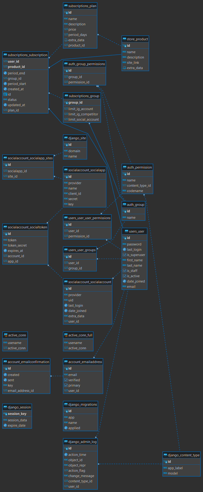

# Schema Public CekBrand

Merupakan Schema data yang menjadi main data dari Toba.ai CekBrand.

## **Akun**

Kelompok tabel yang mengatur data akun pengguna

### **AKUN ALAMAT EMAIL**

Berisi data akun berupa email dan user id pengguna. \
Nama Tabel : ``account_emailaddress``

| **Nama Kolom** | **Tipe**    | **Tipe Data** | **Isi**                                      | **Catatan** |
| -------------- | ----------- | ------------- | -------------------------------------------- | ----------- |
| **id**         | Primary Key | SERIAL        | Nomor ID                                     |             |
| **email**      | \-          | VARCHAR(254)  | Alamat email                                 | Unique Key  |
| **verified**   | \-          | BOOL          | Status terverifikasi                         |             |
| **primary**    | \-          | BOOL          | 111                                          |             |
| **user\_id**   | Foreign Key | INT           | Nomor ID yang merujuk pada table users\_user |             |

### **KONFIRMASI AKUN**

Berisi data akun yang harus dilakukan konfirmasi.\
Nama Tabel : ``account_emailconfirmation``

| **Nama Kolom**         | **Tipe**    | **Tipe Data** | **Isi**                                                      | **Catatan** |
| ---------------------- | ----------- | ------------- | ------------------------------------------------------------ | ----------- |
| **id**                 | PRIMARY KEY | SERIAL4       | Nomor ID                                                     |             |
| **created**            |             | TIMESTAMPTZ   | Timestamp kapan data dibuat                                  |             |
| **sent**               |             | TIMESTAMPTZ   | Timestamp kapan data dikirim                                 |             |
| **key**                |             | VARCHAR(64)   |                                                              |             |
| **email\_address\_id** | FOREIGN KEY | INT4          | Nomor ID email yang merujuk dari tabel account\_emailaddress |             |

## **Auth**

Kelompok tabel yang mengatur autentikasi pengguna

### **PENGELOMPOKAN AUTENTIKASI PENGGUNA**

Berisi field data untuk mendefinisikan user menjadi admin, trial, paid, atau enterprise. \
Nama Tabel : ``auth_group``

| **Nama Kolom** | **Tipe**    | **Tipe Data** | **Isi**                                                                                | **Catatan** |
| -------------- | ----------- | ------------- | -------------------------------------------------------------------------------------- | ----------- |
| **id**         | Primary Key | SERIAL        | Nomor ID                                                                               |             |
| **name**       |             | VARCHAR(150)  | Nama yang memuat _role_ autentikasi, seperti admin, _trial_, _paid_, dam _enterprise_. | UNIQUE KEY |

### **PENGELOMPOKAN AKSI AKSES TERHADAP PENGGUNA**

Berisi field data yang mengelompokkan kelompok user untuk dapat melakukan aksi tertentu berdasarkan permission_id dalam lingkup django dashboard (masih digunakan hanya oleh engineer).
Nama Tabel: ``auth_group_permissions``

| **Nama Kolom**     | **Tipe**    | **Tipe Data** | **Isi**                                           | **Catatan** |
| ------------------ | ----------- | ------------- | ------------------------------------------------- | ----------- |
| **id**             | PRIMARY KEY | SERIAL        | Nomor ID                                          |             |
| **group\_id**      |             | INT           | Nomor ID yang merujuk pada tabel auth\_group.     |UNIQUE KEY |
| **permission\_id** |             | INT           | Nomor ID yang merujuk pada tabel auth\_permission |UNIQUE KEY |

### **PENGELOMPOKAN AKSI AKSES PENGGUNA**

Berisi field data yang mengelompokkan aksi akses yang dapat dilakukan oleh pengguna. \
Nama Tabel: ``auth_permission``

| **Nama Kolom**        | **Tipe**    | **Tipe Data** | **Isi**                                                  | **Catatan** |
| --------------------- | ----------- | ------------- | -------------------------------------------------------- | ----------- |
| **id**                | Primary Key | SERIAL        | Nomor ID                                                 |             |
| **name**              |             | VARCHAR(255)  | Berisi aksi-aksi yang dapat dilakukan                    |             |
| **content\_type\_id** |             | INT           | Nomor ID yang merujuk pada tabel django\_content\_type   | Unique Key  |
| **codename**          |             | VARCHAR(100)  | Berisi aksi-aksi yang dapat dilakukan dalam bentuk kode. | Unique Key  |

## **Django**

Kelompok tabel yang menjadi bawaan dari _framework_ Django

### **DJANGO ADMIN LOG**

Berisi terkait aktivitas dashboard admin. \
Nama Tabel: ``django_admin_log``
| **Nama Kolom**        | **Tipe**    | **Tipe Data** | **Isi**                                                   | **Catatan** |
| --------------------- | ----------- | ------------- | --------------------------------------------------------- | ----------- |
| **id**                | Primary Key | SERIAL        | Nomor ID                                                  |             |
| **action\_time**      |             | TIMESTAMPTZ   | Timestamp untuk menyimpan riwayat waktu dilakukannya aksi |             |
| **object\_id**        |             | TEXT          | 111                                                       |             |
| **object\_repr**      |             | VARCHAR(200)  | 111                                                       |             |
| **action\_flag**      |             | INT           | 111                                                       | CHECK       |
| **change\_message**   |             | TEXT          | Pesan perubahan yang terjadi                              |             |
| **content\_type\_id** | Foreign Key | INT           | Nomor ID yang merujuk pada tabel django\_content\_type    |             |
| **user\_id**          | Foreign Key | INT           | Nomor ID yang merujuk pada tabel user\_users              |             |

### **DJANGO CONTENT TYPE**

Mendifiniskan permission melalui representasi model. \
Nama Tabel: ``django_content_type``

| **Nama Kolom** | **Tipe**    | **Tipe Data** | **Isi**                             | **Catatan** |
| -------------- | ----------- | ------------- | ----------------------------------- | ----------- |
| **id**         | Primary Key | SERIAL4       | Nomor ID                            |             |
| **app\_label** |             | VARCHAR(100)  | Memuat informasi/label _permission_ | Unique Key  |
| **model**      |             | VARCHAR(100)  | Mengkategorikan _permission_        | Unique Key  |

### **DJANGO MIGRATION**

Berisi riwayat perubahan data yang terjadi pada schema (_migrate_). \
Nama Tabel: ``django_migration``

| **Nama Kolom** | **Tipe**    | **Tipe Data** | **Isi**                             | **Catatan** |
| -------------- | ----------- | ------------- | ----------------------------------- | ----------- |
| **id**         | PRIMARY KEY | SERIAL        | Nomor ID                            |             |
| **app**        |             | VARCHAR(255)  | 1111Cari di Dokumentasi Token       |             |
| **name**       |             | VARCHAR(255)  | 1111Cari di Dokumentasi Token       |             |
| **applied**    |             | TIMESTAMTZ    | Timestamp kapan perubahan dilakukan |             |

### **DJANGO SESSION**

Tabel yang berfungsi untuk menyimpan aktivitas session user. \
Nama Tabel: ``django_session``

| **Nama Kolom**    | **Tipe**    | **Tipe Data** | **Isi**                            | **Catatan** |
| ----------------- | ----------- | ------------- | ---------------------------------- | ----------- |
| **session\_key**  | PRIMARY KEY | VARCHAR(40)   | Kunci _session_                    |             |
| **session\_data** |             | TEXT          | Data _session_                     |             |
| **expire\_date**  |             | TIMESTAMPTZ   | Timestamp kapan _session_ berakhir |             |

### **DJANGO SITE**

Menyimpan alamat aplikasi. \
Nama Tabel: ``django_site``

| **Nama Kolom** | **Tipe**    | **Tipe Data** | **Isi**         | **Catatan** |
| -------------- | ----------- | ------------- | --------------- | ----------- |
| **id**         | Primary Key | SERIAL        | Nomor ID        |             |
| **domain**     |             | VARCHAR(100)  | Domain aplikasi | Unique Key  |
| **name**       |             | VARCHAR(50)   | Nama domain     |             |

## **Social Account**

Kelompok tabel yang mengatur pengaturan _Social Account_ yang dimiliki pengguna.

### **SOCIAL ACCOUNT**

Berisi data akun CekBrand dari pengguna. \
Nama Tabel: ``socialaccount_socialaccount``

| **Nama Kolom**   | **Tipe**    | **Tipe Data** | **Isi**                                      | **Catatan** |
| ---------------- | ----------- | ------------- | -------------------------------------------- | ----------- |
| **id**           | Primary Key | SERIAL        | Nomor ID                                     |             |
| **provider**     |             | VARCHAR(30)   | Nama _provider_ media sosial                 | Unique Key  |
| **uid**          |             | VARCHAR(191)  | Nilai numerik _identifier_                   | Unique Key  |
| **last\_login**  |             | TIMESTAMPTZ   | Timestamp kapan terakhir _login_             |             |
| **date\_joined** |             | TIMESTAMPTZ   | Timestamp kapan _user_ bergabung             |             |
| **extra\_data**  |             | TEXT          | Berisi keterangan data lain                  |             |
| **user\_id**     | Foreign Key | INT           | Nomor ID yang merujuk pada tabel user\_users |             |

### **APLIKASI AKUN SOSIAL**

Berisi data sosial media yang digunakan. \
Nama Tabel: ``socialaccount_socialapp``

| **Nama Kolom** | **Tipe**    | **Tipe Data** | **Isi**                      | **Catatan** |
| -------------- | ----------- | ------------- | ---------------------------- | ----------- |
| **id**         | Primary Key | SERIAL        | Nomor ID                     |             |
| **provider**   |             | VARCHAR(30)   | Nama _provider_ media sosial |             |
| **name**       |             | VARCHAR(40)   | Nama Social App              |             |
| **client\_id** |             | VARCHAR(191)  | Nomor ID dari _provider_     |             |
| **secret**     |             | VARCHAR(191)  | Token yang bersifat rahasia  |             |
| **key**        |             | VARCHAR(191)  | 111                          |             |

### **_SITES_ APLIKASI AKUN SOSIAL**

Merupakan tabel yang mengintegrasikan atau mengelompokkan aplikasi akun sosial dengan sites Toba.ai. \
Nama Tabel: ``socialaccount_socialapp_sites``

| **Nama Kolom**    | **Tipe**    | **Tipe Data** | **Isi**                                                   | **Catatan** |
| ----------------- | ----------- | ------------- | --------------------------------------------------------- | ----------- |
| **id**            | PRIMARY KEY | SERIAL        | Nomor ID                                                  |             |
| **socialapp\_id** |             | INT           | Nomor ID yang merujuk pada tabel socialaccount\_socialapp | UNIQUE KEY  |
| **site\_id**      |             | INT           | Nomor ID yang merujuk pada tabel django\_site             | UNIQUE KEY  |

### **TOKEN APLIKASI**

 Berisi field data yang memberikan Token pada setiap akun dan aplikasi. \
 Nama Tabel: ``socialaccount_socialtoken``

| **Nama Kolom**    | **Tipe**    | **Tipe Data** | **Isi**                                                       | **Catatan** |
| ----------------- | ----------- | ------------- | ------------------------------------------------------------- | ----------- |
| **id**            | PRIMARY KEY | SERIAL        | Nomor ID                                                      |             |
| **token**         |             | TEXT          | Token untuk autentikasi dengan provider Sosmed                |             |
| **token\_secret** |             | TEXT          | Secret Token                                                  |             |
| **expires\_at**   |             | TIMESTAMPTZ   | Timestamp kapan status _user_ berakhir                        |             |
| **account\_id**   | FOREIGN KEY | INT           | Nomor ID yang merujuk pada tabel socialaccount\_socialaccount |             |
| **app\_id**       | FOREIGN KEY | INT           | Nomor ID yang merujuk pada tabel socialaccount\_socialapp     |             |

## **Store Product**

Kelompok tabel yang menyimpan data layanan yang dimiliki CekBrand

### **STORE PRODUCT**

Berisi field data yang berisi produk atau layanan dari CekBrand. \
Nama Tabel: ``store_product``

| **Nama Kolom**  | **Tipe**    | **Tipe Data** | **Isi**                          | **Catatan** |
| --------------- | ----------- | ------------- | -------------------------------- | ----------- |
| **id**          | Primary Key | SERIAL        | Nomor ID                         |             |
| **name**        |             | VARCHAR(40)   | Nama produk                      |             |
| **description** |             | TEXT          | Deskripsi produk                 |             |
| **site\_link**  |             | VARCHAR(200)  | Tautan situs produk              |             |
| **extra\_data** |             | JSONB         | Informasi lainnya berbentuk json |             |

## **Subscription**

Kelompok tabel yang menyimpan data pengguna untuk melakukan langganan

### **SUBSCRIPTION GROUP**

Berisi field data yang memberikan informasi terkait batasan akun ig, kompetitor ig, dan social account. \
Nama Tabel: ``subscriptions_group``

| **Nama Kolom**             | **Tipe**    | **Tipe Data** | **Isi**                                      | **Catatan** |
| -------------------------- | ----------- | ------------- | -------------------------------------------- | ----------- |
| **group\_id**              | Foreign Key | INT           | Nomor ID yang merujuk pada tabel auth\_group |             |
| **limit\_ig\_account**     |             | INT           | 111                                          |             |
| **limit\_ig\_competitor**  |             | INT           | 111                                          |             |
| **limit\_social\_account** |             | INT           | 111                                          |             |

### **SUBSCRIPTION PLAN**

Berisi field data yang men-define plan atau paket langganan apa saja yang disediakan Toba.ai CekBrand. \
Nama Tabel: ``subscriptions_plan``

| **Nama Kolom**   | **Tipe**    | **Tipe Data** | **Isi**                                         | **Catatan** |
| ---------------- | ----------- | ------------- | ----------------------------------------------- | ----------- |
| **id**           | Primary Key | SERIAL        | Nomor ID                                        |             |
| **name**         |             | VARCHAR(225)  | Nama paket langganan                            |             |
| **description**  |             | TEXT          | Deskripsi paket langganan                       |             |
| **price**        |             | INT           | Harga paket langganan                           |             |
| **period\_days** |             | INT           | Durasi paket langganan                          |             |
| **extra\_data**  |             | JSONB         | Informasi tambahan berbentuk jsonb              |             |
| **product\_id**  | Foreign Key | INT           | Nomor ID yang merujuk pada tabel store\_product |             |

### **AKUN BERLANGGANAN**

Berisi field data yang berisi user yang telah melakukan langganan. \
Nama Tabel: ``subscriptions_subscription``

| **Nama Kolom**    | **Tipe**    | **Tipe Data** | **Isi**                                                   | **Catatan** |
| ----------------- | ----------- | ------------- | --------------------------------------------------------- | ----------- |
| **user\_id**      | Foreign Key | INT           | Nomor ID yang merujuk pada tabel users\_user              | Unique Key  |
| **product \_id**  | Foreign Key | INT           | Nomor ID yang merujuk pada tabel store\_product           | Unique Key  |
| **period\_end**   |             | TIMESTAMPTZ   | Timestamp kapan status langganan berakhir                 |             |
| **group\_id**     | Foreign Key | INT           | Nomor ID yang merujuk pada tabel subscriptions\_group     |             |
| **period\_start** |             | TIMESTAMPTZ   | Timestamp kapan status langganan berakhir                 |             |
| **created\_at**   |             | TIMESTAMPTZ   | Timestamp kapan status langganan dimulai                  |             |
| **id**            |             | UUID          | Nomor ID                                                  | Unique Key  |
| **status**        |             | VARCHAR(10)   | Status langganan                                          |             |
| **updated\_at**   |             | TIMESTAMPTZ   | Timestamp kapan terakhir kali status langganan diperbarui |             |
| **plan\_id**      | Foreign Key | INT           | Nomor ID yang merujuk pada tabel subscriptions\_plan      |             |

## **User**

Kelompok tabel yang mengatur akun _user_ Toba Ai

### **AKUN PENGGUNA**

Berisi field data pengguna. \
Nama Tabel: ``users_user``

| **Nama Kolom**    | **Tipe**    | **Tipe Data** | **Isi**                                              | **Catatan** |
| ----------------- | ----------- | ------------- | ---------------------------------------------------- | ----------- |
| **id**            | PRIMARY KEY | SERIAL        | Nomor ID                                             |             |
| **password**      |             | VARCHAR(128)  | Token yang berisi password akun dari _user_          |             |
| **last\_login**   |             | TIMESTAMPTZ   | Timestamp kapan terakhir kali _user_ melakukan login |             |
| **is\_superuser** |             | BOOL          | Status Super _User_                                  |             |
| **first\_name**   |             | VARCHAR(150)  | Nama awal _user_                                     |             |
| **last\_name**    |             | VARCHAR(150)  | Nama akhir _user_                                    |             |
| **is\_staff**     |             | BOOL          | Status apakah _staff_ atau bukan                     |             |
| **is\_active**    |             | BOOL          | Status apakah aktif atau bukan                       |             |
| **date\_joined**  |             | TIMESTAMPTZ   | Timestamp kapan _user_ bergabung                     |             |
| **email**         |             | VARCHAR(254)  | Email _user_ yang didaftarkan                        | Unique Key  |

### **USER GROUP**

Berisi field data terkait data pengguna dan pelanggan. \
Nama Tabel: ``users_user_groups``

| **Nama Kolom** | **Tipe**    | **Tipe Data** | **Isi**                                               | **Catatan** |
| -------------- | ----------- | ------------- | ----------------------------------------------------- | ----------- |
| **id**         | Primary Key | SERIAL4       | Nomor ID                                              |             |
| **user\_id**   | Foreign Key | INT           | Nomor ID yang merujuk pada tabel users\_user          | Unique Key  |
| **group\_id**  | Foreign Key | INT           | Nomor ID yang merujuk pada tabel subscriptions\_group | Unique Key  |

### **_Permissions User_**

Berisi field data yang mengelompokkan pengguna degan permission yang dapat dilakukan. \
Nama Tabel: ``users_user_user_permissions``

| **Nama Kolom**     | **Tipe**    | **Tipe Data** | **Isi**                                           | **Catatan** |
| ------------------ | ----------- | ------------- | ------------------------------------------------- | ----------- |
| **id**             | PRIMARY KEY | SERIAL        | Nomor ID                                          |             |
| **user\_id**       | FOREIGN KEY | INT           | Nomor ID yang merujuk pada tabel users\_user      |             |
| **permission\_id** | FOREIGN KEY | INT           | Nomor ID yang merujuk pada tabel auth\_permission |             |
